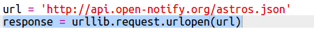
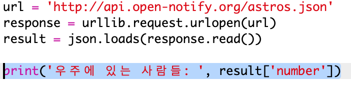
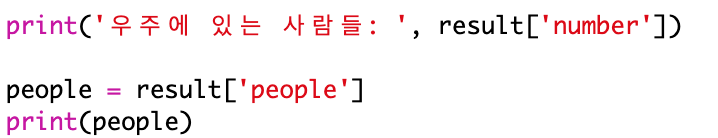
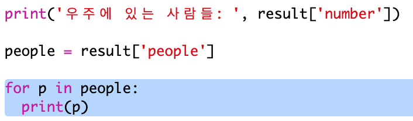
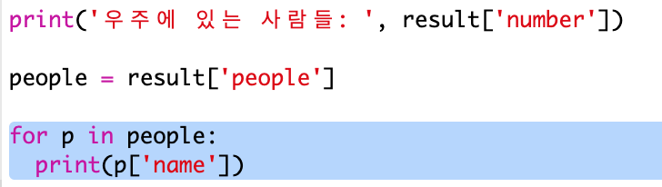

## 우주에 누가 있나요?

여러분은 우주에 대한 실시간 정보를 불러오는 웹 서비스를 사용하게 됩니다. 먼저, 지금 우주에 누가 있는지 알아보겠습니다.

웹 서비스에는 웹 사이트처럼 주소(URL)를 가지고 있습니다. 하지만 페이지의 HTML을 보여주는 것이 아닌, 데이터를 반환합니다.

+ 웹 브라우저에서 <a href="http://api.open-notify.org/astros.json" target="_blank">웹 서비스 열기</a>

아래와 같은 데이터를 볼 수 있습니다:

    {
      "message": "success",
      "number": 3,
      "people": [
        {
          "craft": "ISS",
          "name": "Yuri Malenchenko"
        },
        {
          "craft": "ISS",
          "name": "Timothy Kopra"
        },
        {
          "craft": "ISS",
          "name": "Timothy Peake"
        }
      ]
    }
    

이 데이터는 실시간 데이터를 제공하므로, 위 데이터와는 약간 다른 결과가 나타날 것입니다. 또한 웹 서비스에서 영어로 이름이 제공되기 때문에, 우리는 한국어 데이터가 아닌 영어 데이터를 처리해 볼 것입니다. 이 데이터 포맷은 `JSON`이라고 하고, 'Jason' 과 같이 발음합니다.

[[[generic-json]]]

Python 스크립트에서 웹 서비스를 호출해서 데이터를 사용해봅시다.

+ 템플릿 Trinket을 열어주세요: <http://rpf.io/iss-on>{:target="_blank"}.

`urllib.request`과 `json` 모듈은 `main.py` script에 import되어 있습니다.

+ `main.py`에 아래 코드를 추가하여 웹 서비스의 URL을 변수로 저장할 수 있도록 하세요:

+ 웹 서비스를 호출하세요:

+ 다음으로 JSON 데이터를 Python으로 불러와 봅시다:

아래와 같은 데이터를 볼 수 있습니다:

    {'message': 'success', 'number': 3, 'people': [{'craft': 'ISS', 'name': 'Yuri Malenchenko'}, {'craft': 'ISS', 'name': 'Timothy Kopra'}, {'craft': 'ISS', 'name': 'Timothy Peake'}]}
    

`message`, `number`, `people`은 Python 딕셔너리 키입니다.

[[[generic-python-key-value-pairs]]]

`message` 에 `success` 값이 뜬다면 웹 서비스에 정상적으로 접속했다는 뜻입니다. 누가 우주에 있는지에 따라 `number`와 `people`의 값이 다르게 표시됩니다.

이제 정보를 더 읽기 쉬운 방식으로 출력해 봅시다.

+ 먼저 우주에 있는 사람들의 수를 찾아서 출력해 봅시다.

`result['number']` 는 `result` 딕셔너리 안의 `number` 키에 대한 값을 출력합니다. 예시에서는, `3`이 출력됩니다.

+ `people` 딕셔너리는 우주에 있는 사람들의 정보를 담고 있습니다. 이 값을 출력할 수 있도록 변수에 넣어 봅시다.

아래와 같은 데이터를 볼 수 있습니다:

    [{'craft': 'ISS', 'name': 'Yuri Malenchenko'}, {'craft': 'ISS', 'name': 'Timothy Kopra'}, {'craft': 'ISS', 'name': 'Timothy Peake'}]
    

+ 이제 각 우주인들에 대한 정보를 출력해야 합니다. Python의 반복문인 `for`문을 사용해서 문제를 해결해 봅시다.

[[[generic-python-for-loop-list]]]

+ 루프를 반복할 때마다, `p` 변수는 다른 우주 비행사의 딕셔너리로 설정됩니다.

+ 이 변수는 딕셔너리의 `name`과 `craft`로 이루어져 있습니다. 우주인들의 이름을 출력해 봅시다:

아래와 같이 출력될 것입니다.

    우주에 있는 사람들:  3
    Yuri Malenchenko
    Timothy Kopra
    Timothy Peake
    

**참고:** 실시간 데이터를 사용하고 있으므로, 결과는 현재 우주에 있는 사람들에 따라서 변동될 수 있습니다.