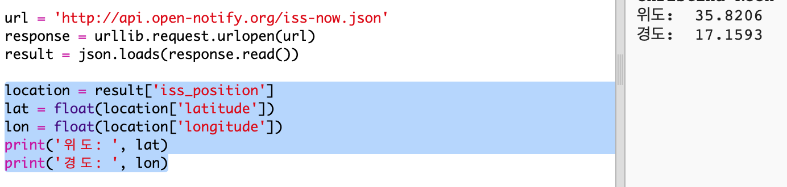

## ISS는 어디에 있나요?

국제우주정거장은 우리 지구 궤도에 있습니다. 대략 1시간 반마다 지구의 궤도 한바퀴를 돌고, 초당 7.66km의 평균 속도로 이동합니다. 엄청 빠릅니다!

국제 우주 정거장이 어디에 있는지 알아보기 위해 또 다른 웹 서비스를 사용해 봅시다.

+ 먼저 웹 브라우저의 새 탭에서 이 웹서비스 URL을 엽니다. <a href="http://api.open-notify.org/iss-now.json" target="_blank"> http://api.open-notify.org/iss-now.json </a>

아래와 같은 데이터를 볼 수 있습니다:

    {
    "iss_position": {
      "latitude": 8.54938193505081, 
      "longitude": 73.16560793639105
    }, 
    "message": "success", 
    "timestamp": 1461931913
    }
    

ISS의 위치는 지구 상의 좌표로 표시됩니다.

[[[generic-theory-lat-long]]]

+ 이제 Python에서 웹 서비스를 호출해야합니다. 아래 코드를 스크립트의 끝에 추가해서 ISS의 현재 위치를 얻어 봅시다:

+ 위도와 경도를 저장하는 변수를 만들어 출력하세요:

