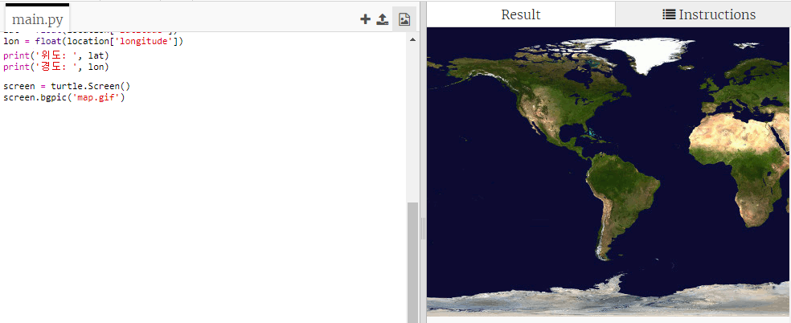
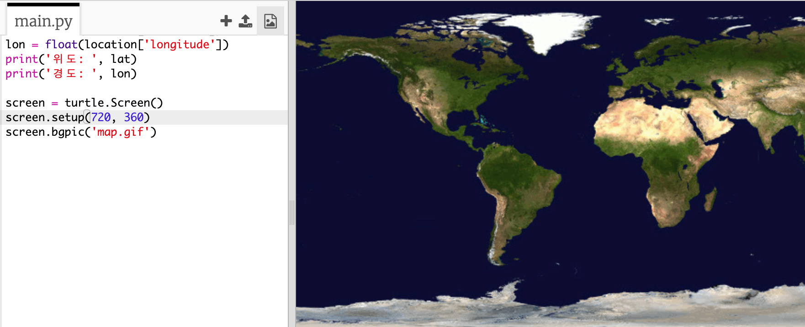
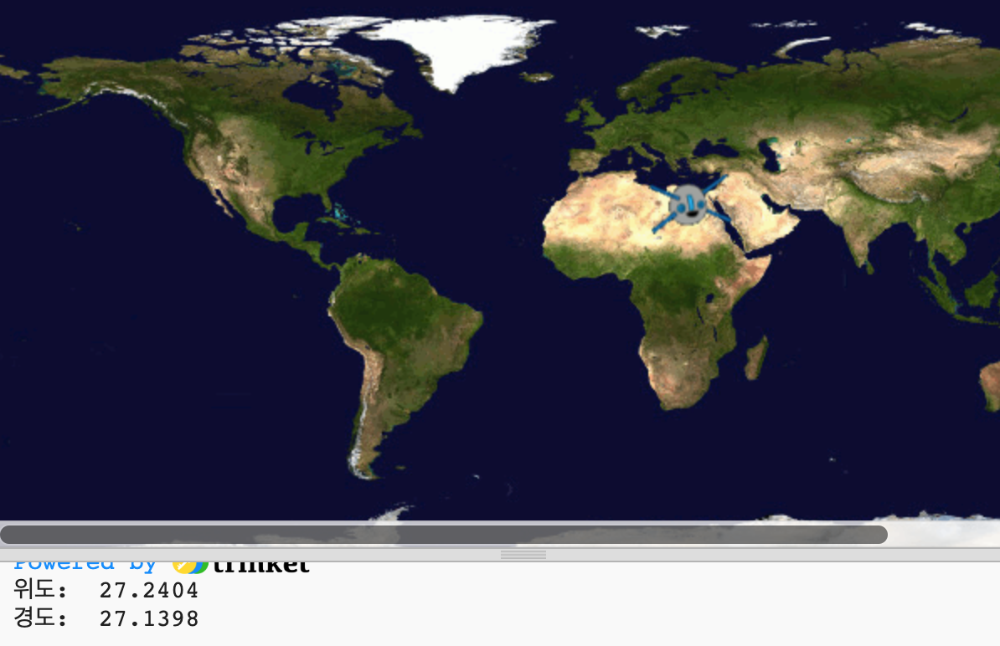

## 지도에 ISS 띄우기

ISS의 위치를 지도에 표시해 준다면 더 알아보기 쉽겠죠. Python의 Turtle graphics를 이용해서 작업을 수행할 수 있습니다.

+ 먼저, `turtle` 라이브러리를 불러와야 합니다.

+ 다음으로, 세계 지도를 배경 이미지로 불러오세요. 이미 trinket에 'map.gif'라는 파일이 있을겁니다! NASA는 이 아름다운 지도를 누구나 사용, 배포할 수 있도록 허가했습니다. 

이 지도의 중심은 `(0,0)`으로 각각 위도와 경도를 뜻합니다.

+ 이제 720 x 360 픽셀의 이미지 크기와 같도록 화면 크기를 설정해야 합니다. `screen.setup(720,360)`을 추가합니다:

+ turtle을 특정 위도와 경도로 보낼 수 있도록 합니다. 이 작업을 쉽게 하려면, 사용 중인 좌표와 일치하도록 화면을 설정할 수 있습니다:

이제 좌표는 웹 서비스에서 가져온 위도와 경도 좌표와 일치하게 됩니다.

+ ISS를 나타낼 turtle 아이콘을 만들어 봅시다. trinket에는 이미 'iss.gif', 'iss2.gif'가 들어있습니다. - 둘 다 시도해 보고 어떤 것이 마음에 드는지 골라 보세요. 

[[[generic-python-turtle-image]]]

--- hints ---
 --- hint ---

다음과 같은 코드가 될 것입니다.:

--- /hint --- --- /hints ---

+ ISS는 지도의 중심에서 움직이기 시작하고, 이제 올바른 위치로 옮겨 봅시다:

**참고:** 보통 위도가 먼저 주어지지만, `(x,y)`를 그릴 때에는 경도를 먼저 지정해 주어야 합니다.

+ 프로그램을 테스트해 보세요. ISS는 현재 지구 상의 위도, 경도로 이동해야 합니다. 

+ 조금 기다렸다가 프로그램을 다시 실행해서 ISS가 어디로 이동했는지 확인해 보세요.