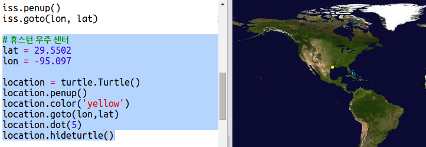
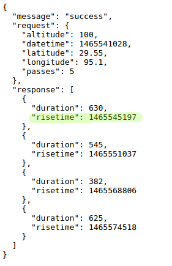
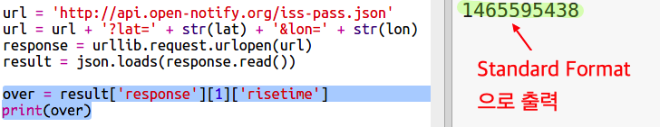

## ISS는 언제 특정 위치를 통과하나요?

ISS가 어느 특정 위치에 있는지 알아내는 데 사용할 수 있는 웹 서비스가 있습니다.

언제 ISS가 휴스턴에 있는 우주 센터를 통과하는지 알아 봅시다. 휴스턴 우주센터의 위도는 `29.5502`이고 경도는 `95.097` 입니다.

+ 먼저 좌표에서 점을 찍어 봅시다.

그리고 ISS가 통과하는 날짜와 시간을 봅시다.

+ 이전과 마찬가지로 웹 브라우저의 주소 표시 줄에 URL을 입력하여 웹 서비스를 호출 할 수 있습니다. <a href="http://api.open-notify.org/iss-pass.json" target="_blank"> api.open-notify.org/iss-pass.json </a>

아래 오류가 표시될 것입니다:

이 웹 서비스는 위도와 경도를 입력받기 때문에, 이 정보를 URL에서 알려주어야 합니다. 입력은 `?` 뒤에 `&`으로 구분되어 입력됩니다.

+ 아래와 같이 `lat`과 `lon` 정보를 URL에 반영합니다: <a href="http://api.open-notify.org/iss-pass.json?lat=29.55&lon=95.1" target="_blank">api.open-notify.org/iss-pass.json?lat=29.55&lon=95.1</a>

데이터를 받기에는 대기 시간이 걸릴 수 있으며, 첫번째 데이터만 살펴 봅시다. 시간은 UNIX 타임 스탬프로 주어지는데, 이를 Python 스크립트에서 읽을 수 있는 시간으로 변환할 수 있습니다.

[[[generic-unix-timestamp]]]

+ 이제 Python에서 웹 서비스를 호출해야합니다. 스크립트의 끝에 다음 코드를 추가하십시오:

+ 이제 첫번째 통과 시간을 확인해 봅시다. 다음 코드를 에 추가하십시오:

Python의 `time` 모듈을 불러와 읽을 수 있는 형태로 출력하고 현재 시간으로 변환해 봅시다. 그리고 휴스턴 우주 센터의 통과 시각을 출력할 수 있습니다.

+ 스크립트 상단에 `import time`을 추가해주세요:

+ `time.ctime()` 함수는 타임스탬프를 읽을 수 있는 형식으로 변환합니다.

(`print` 라인을 제거하거나 `#`을 사용하여 주석처리 해도 됩니다.)

+ 원하는 경우 텍스트의 색상과 형식을 변경할 수 있습니다. 

[[[generic-python-turtle-write]]]