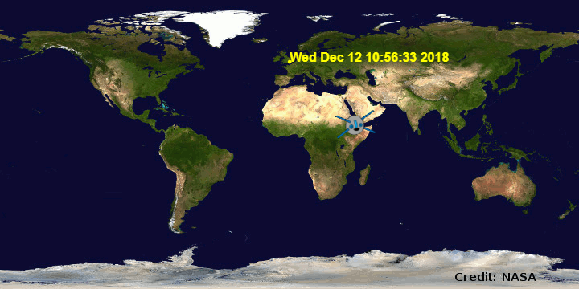

## Uvod

U ovom projektu koristićeš veb uslugu da saznaš gdje se trenutno nalazi Međunarodna svemirska stanica (ISS) i da ucrtaš njenu lokaciju na kartu.

### Uputstvo

Ikona svemirske stanice pokazuje trenutnu lokaciju ISS. Žuti tekst pokazuje kada će ISS proći iznad Svemirskog centra u Hjustonu, SAD.

  <iframe src="https://trinket.io/embed/python/b95851338c?outputOnly=true&start=result" width="600" height="500" frameborder="0" marginwidth="0" marginheight="0" allowfullscreen>
  </iframe>
  

### Šta ćeš naučiti

Ovim projektom obuhvaćeni su elementi iz sljedećih dijelova [Raspberry Pi Digital Making Curriculum](http://rpf.io/curriculum):

+ [Kombinujte programske konstrukcije za rješavanje problema.](https://www.raspberrypi.org/curriculum/programming/builder)