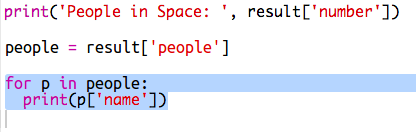

## Ko je u svemiru?

Koristićeš veb uslugu koja uživo pruža informacije o svemiru. Saznajmo prvo ko se trenutno nalazi u svemiru.

Veb usluga ima svoju adresu (URL), baš kao i veb-sajt. Umjesto da vraća HTML za veb-stranicu, vraća podatke.

+ Otvori <a href="http://api.open-notify.org/astros.json" target="_blank">veb uslugu</a> u veb-pregledaču.

Trebalo bi da vidiš nešto slično ovome:

    {
      "message": "success",
      "number": 3,
      "people": [
        {
          "craft": "ISS",
          "name": "Yuri Malenchenko"
        },
        {
          "craft": "ISS",
          "name": "Timothy Kopra"
        },
        {
          "craft": "ISS",
          "name": "Timothy Peake"
        }
      ]
    }
    

Podaci se prikazuju uživo, pa ćeš vjerovatno vidjeti malo drugačiji rezultat. Format podataka se zove `JSON` (izgovara se kao 'Džejson').

[[[generic-json]]]

Treba da pozoveš veb uslugu iz Python skripte kako bi mogao/mogla da koristiš rezultate.

+ Open this trinket: <http://rpf.io/iss-on>{:target="_blank"}.

Moduli `urllib.request` i `json` već su uvezeni za tebe na početku `main.py` skripte.

+ Dodaj sljedeći kôd u `main.py` da URL veb usluge kojoj smo upravo pristupili sačuvaš kao promjenljivu:

+ Sada pozovi veb uslugu:

+ Zatim treba da učitaš JSON odgovor u strukturu podataka u Pythonu:

Trebalo bi da vidiš nešto slično ovome:

    {'message': 'success', 'number': 3, 'people': [{'craft': 'ISS', 'name': 'Yuri Malenchenko'}, {'craft': 'ISS', 'name': 'Timothy Kopra'}, {'craft': 'ISS', 'name': 'Timothy Peake'}]}
    

Ovo je Pythonov rječnik koji sadrži tri ključa: `message` (poruka), `number` (broj) i `people` (osobe).

[[[generic-python-key-value-pairs]]]

Vrijednost `poruke` (message) je `success`, što znači da si uspješno pristupio/pristupila veb usluzi. Imaj u vidu da ćeš vidjeti različite rezultate za `number` i `people`, u zavisnosti od toga ko je trenutno u svemiru.

Sada ispišimo informacije u obliku koji će biti jednostavnije pročitati.

+ Prvo pronađimo broj osoba u svemiru i ispišimo ga:

`rezultat['number']` će u rječnik `rezultat` ispisati vrijednost povezanu sa ključem `number`. To je u ovom primjeru `3`.

+ Vrijednost povezana sa ključem `people` je lista rječnika! Stavimo ovu vrijednost u promjenljivu kako bismo je mogli koristiti:

Trebalo bi da vidiš nešto slično ovome:

    [{'craft': 'ISS', 'name': 'Yuri Malenchenko'}, {'craft': 'ISS', 'name': 'Timothy Kopra'}, {'craft': 'ISS', 'name': 'Timothy Peake'}]
    

+ Sada treba da ispišeš red za svakog astronauta. U Pythonu za to možeš da koristiš `for` petlju.

[[[generic-python-for-loop-list]]]

+ U svakom prolazu kroz petlju, `p` će biti postavljeno u rječnik za različitog astronauta.

+ Zatim možeš da potražiš vrijednosti za `name` i `craft`. Prikažimo imena osoba u svemiru:

Trebalo bi da vidiš nešto slično ovome:

    Osobe u svemiru:  3
    Yuri Malenchenko
    Timothy Kopra
    Timothy Peake
    

**Napomena:** Koristiš podatke koji se dobijaju uživo, pa će tvoji rezultati zavisiti od broja ljudi koji su trenutno u svemiru.