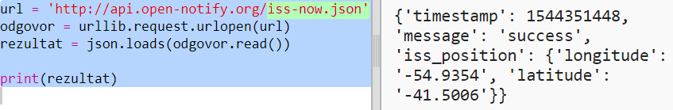
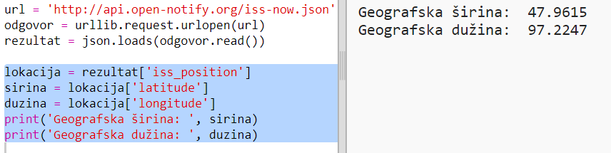

## Gdje se nalazi ISS?

Međunarodna svemirska stanica nalazi se u orbiti oko Zemlje. Napravi krug oko Zemlje otprilike svakih sat i po vremena, a prosječna brzina joj je 7,66 km u sekundi. Brza je!

Koristićemo drugu veb uslugu da saznamo gdje se nalazi Međunarodna svemirska stanica.

+ Prvo otvori URL veb usluge u novoj kartici svog veb-pregledača: <a href="http://api.open-notify.org/iss-now.json" target="_blank">http://api.open-notify.org/iss-now.json</a>

Trebalo bi da vidiš nešto slično ovome:

    {
    "iss_position": {
      "latitude": 8.54938193505081, 
      "longitude": 73.16560793639105
    }, 
    "message": "success", 
    "timestamp": 1461931913
    }
    

Rezultat sadrži koordinate mjesta na Zemlji iznad kojeg se trenutno nalazi ISS.

[[[generic-theory-lat-long]]]

+ Sada ovu istu veb uslugu treba da pozoveš iz Pythona. Dodaj sljedeći kôd na kraju svoje skripte kako bi dobio/dobila trenutnu lokaciju ISS:

+ Kreirajmo promjenljive u koje ćemo smjestiti geografsku širinu i geografsku dužinu, a zatim ih ispišimo:

