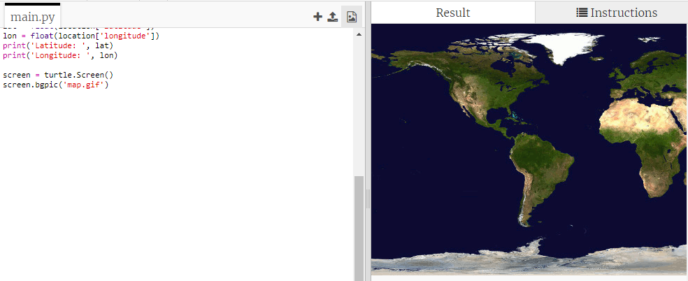
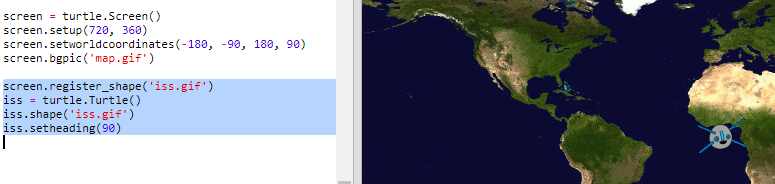

## Ucrtavanje ISS na kartu

Bilo bi korisno da prikažemo poziciju na karti. To možeš da uradiš koristeći kornjačinu grafiku u Pythonu!

+ Prvo treba da uvezemo `turtle` biblioteku u Pythonu:

+ Zatim učitaj kartu svijeta kao pozadinsku sliku. There’s one already included in your trinket called 'map.gif'! NASA je obezbijedila ovu divnu kartu i dala dozvolu za njeno korišćenje. 

Karta je centrirana na geografskoj širini i dužini `(0,0)`, a to je upravo ono što ti je potrebno.

+ Treba da podesiš veličinu ekrana na 720 sa 360 piksela tako da odgovara veličini slike. Dodaj `ekran.setup(720, 360)`:

+ Potrebno je da kornjaču šalješ na određenu geografsku širinu i dužinu. Da bi to bilo lakše, možeš da podesiš ekran tako da odgovara koordinatama koje koristiš:

Sada će koordinate odgovarati geografskoj širini i dužini koje dobiješ sa veb usluge.

+ Kreirajmo ikonu kornjače za ISS. Your trinket includes 'iss.gif' and 'iss2.gif' — try them both and see which one you prefer. 

[[[generic-python-turtle-image]]]

\--- hints \--- \--- hint \---

Tvoj kôd treba da izgleda ovako:

\--- /hint \--- \--- /hints \---

+ ISS se nalazi na sredini karte. Pomjerimo je sada na ispravnu lokaciju:

**Napomena**: geografska širina se obično daje prva, ali mi treba prvo da damo geografsku dužinu kada ucrtavamo `(x,y)` koordinate.

+ Pokreni i isprobaj svoj program. ISS bi trebalo da se pomjeri na svoju trenutnu lokaciju iznad Zemlje. 

+ Sačekaj nekoliko sekundi, a zatim ponovo pokreni svoj program da provjeriš gdje se pomjerila ISS.