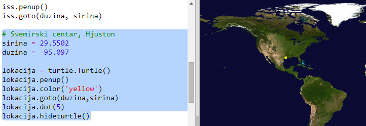
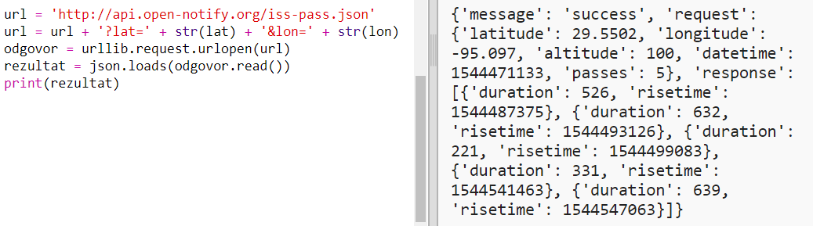
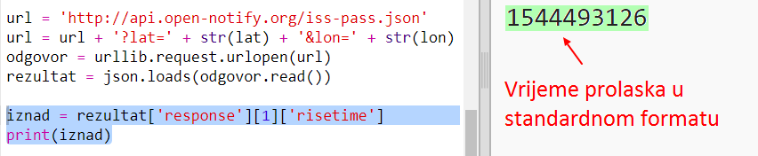
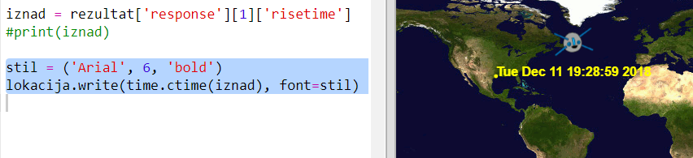

## Kada će ISS biti iznad nas?

Postoji i veb usluga koju možeš koristiti da saznaš kada će ISS biti iznad određene lokacije.

Saznajmo kada će ISS biti iznad Svemirskog centra u Hjustonu, SAD. Geografska širina Svemirskog centra je `29.5502`, a dužina `95.097`.

+ Ucrtajmo prvo tačku na karti na ovim koordinatama:

Sada saznajmo datum i vrijeme kada će sljedeći put ISS proći iznad Svemirskog centra.

+ Kao i prije, veb usluzi možeš pristupiti tako što ćeš unijeti njen URL u adresnu traku veb-pregledača: <a href="http://api.open-notify.org/iss-pass.json" target="_blank">api.open-notify.org/iss-pass.json</a>

Trebalo bi da dobiješ poruku o grešci:

Ova veb usluga koristi geografsku širinu i dužinu kao ulazne podatke, pa ih moraš unijeti u URL. Ulazni podaci dodaju se poslije znaka `?` i odvajaju se znakom `&`.

+ Dodaj ulazne podatke `lat` i `lon` u URL kao što je prikazano ovdje: <a href="http://api.open-notify.org/iss-pass.json?lat=29.55&lon=95.1" target="_blank">api.open-notify.org/iss-pass.json?lat=29.55&lon=95.1</a> 

Odgovor sadrži vremena za nekoliko prolazaka, a mi ćemo pogledati samo prvo. Vrijeme je dato kao Unix vremenska oznaka (u tvojoj skripti u Pythonu moći ćeš da ga pretvoriš u vrijeme koje se može čitati).

[[[generic-unix-timestamp]]]

+ Pozovimo sada veb uslugu iz Pythona. Dodaj sljedeći kôd na kraju svoje skripte:

+ Sada ćemo iz rezultata upotrijebiti prvo vrijeme prolaska. Dodaj sljedeći kôd:

Potreban nam je Python modul `time` kako bismo mogli da ga ispišemo u čitljivom obliku i da ga pretvorimo u lokalno vrijeme. Zatim ćemo napraviti da skripta upiše vrijeme prolaska pored tačke za Hjuston.

+ Dodaj red `import time` na početku svoje skripte:

+ Funkcija `time.ctime()` pretvoriće vremensku oznaku u čitljivi oblik koji možeš upisati na svoju kartu:

(Možeš ukloniti red `print` ili ga komentarisati dodajući `#` na početku, tako da ga tvoja skripta ignoriše.)

+ Ako želiš, možeš promijeniti boju i format teksta. 

[[[generic-python-turtle-write]]]