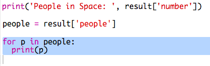

## अंतराळात कोण आहे?

आपण स्थानाबद्दल थेट माहिती मिळवण्यासाठी एक वेब सेवा वापरणार आहाेत. प्रथम, अंतराळात सध्या कोण आहे ते शोधू.

वेबसाइट प्रमाणेच वेब सेवेला एक पत्ता (URL) असतो. वेब पृष्ठासाठी HTML परत आणण्याऐवजी ते डेटा परत करते.

+ वेब ब्राउझरमध्ये <a href="http://api.open-notify.org/astros.json" target="_blank">the web service</a> उघडा.

तुमच्याकडे असे काहीतरी दिसायला हवे:

```
{
  "message": "success",
  "number": 3,
  "people": [
    {
      "craft": "ISS",
      "name": "Yuri Malenchenko"
    },
    {
      "craft": "ISS",
      "name": "Timothy Kopra"
    },
    {
      "craft": "ISS",
      "name": "Timothy Peake"
    }
  ]
}
```
    
डेटा लाइव्ह आहे, म्हणून आपणास कदाचित थोड्या वेगळ्या प्रकारचा परिणाम दिसू शकताे. डेटा स्वरूपाला `JSON` असे म्हणतात('जेसन' असे उच्चारतात).

[[[generic-json]]]

आपल्याला पायथन स्क्रिप्टवरुन वेब सेवेवर कॉल करण्याची आवश्यकता आहे, जेणेकरून आपण परिणाम वापरू शकू.

+ हा trinket: [http://rpf.io/iss-on](http://rpf.io/iss-on){:target="_blank"} उघडा.

`urllib.request` आणि `json` आपल्यासाठी `main.py` स्क्रिप्टच्या शीर्षस्थानी मॉड्यूल आधीपासून आयात केले गेले आहेत.

+ आपण फक्त चल म्हणून प्रवेश केलेल्या वेब सेवेची URL समाविष्ट करण्यासाठी `main.py` वर खालील कोड जोडा:


+ आता वेब सेवेवर कॉल करा:


+ पुढे आपल्याला Python data structure मध्ये JSON प्रतिसाद लोड करणे आवश्यक आहे:


तुमच्याकडे असे काहीतरी दिसायला हवे:

```
{'message': 'success', 'number': 3, 'people': [{'craft': 'ISS', 'name': 'Yuri Malenchenko'}, {'craft': 'ISS', 'name': 'Timothy Kopra'}, {'craft': 'ISS', 'name': 'Timothy Peake'}]}
```

Python dictionary च्या तीन की(keys) आहेत: `message`, `number`, and `people`.

[[[generic-python-key-value-pairs]]]

तो `message` आपल्याला सांगते की आपण वेब सेवेवर `success` प्रवेश केला. लक्षात घ्या की आपल्याला `number` आणि `people` साठी भिन्न परिणाम दिसतील ते सध्या अवकाशात कोण आहे यावर अवलंबून आहे.

आता अधिक वाचनीय पध्दतीने माहिती मुद्रित(print) करू.

+ प्रथम, अवकाशातील लोकांची संख्या शोधू आणि मुद्रित करा:


`result['number']` जे मूल्य मुद्रित करेल ते `result` dictionary मधील `number` या कीच (key) मूल्य असेल. उदाहरणार्थ, हे ` 3 `आहे.

+ `people` की(key) सोबत जे मूल्य आहे ते dictionaries ची यादी आहे! चला त्या व्हेरिएबलमध्ये व्हॅल्यू ठेवू म्हणजे आपण ते वापरू शकाल:


तुमच्याकडे असे काहीतरी दिसायला हवे:

```
[{'craft': 'ISS', 'name': 'Yuri Malenchenko'}, {'craft': 'ISS', 'name': 'Timothy Kopra'}, {'craft': 'ISS', 'name': 'Timothy Peake'}]
```
    
+ आता आपल्याला प्रत्येक अंतराळवीरांसाठी एक ओळ मुद्रित करण्याची आवश्यकता आहे. आपण हे करण्यासाठी Python `for` loop(लूप) वापरू शकता.

+ प्रत्येक वेळी लूपमधून `p` वेगळ्या अंतराळवीरांच्या dictionary वर सेट केले जाईल.



+ त्यानंतर आपण `name` आणि `craft` नावाची मूल्ये शोधू शकता. चला अवकाशातील लोकांची नावे दाखवू:


तुमच्याकडे असे काहीतरी दिसायला हवे:

```
People in Space:  3
Yuri Malenchenko
Timothy Kopra
Timothy Peake
```

__टीपः__ आपण थेट डेटा वापरत आहात, म्हणून आपले परिणाम सध्या अंतराळातील लोकांच्या संख्येवर अवलंबून असतील.
