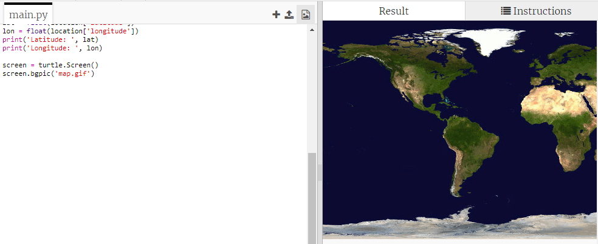

## नकाशावर ISS प्लॉट करत आहे

नकाशावर स्थान दर्शविणे उपयुक्त ठरेल. Python Turtle ग्राफिक्स वापरून आपण हे करू शकता!

+ Load a world map as the background image. आपल्या trinket मध्ये यापूर्वीच 'map.gif' नावाचा एक छायाचित्र समाविष्ट आहे! नासाने हा सुंदर नकाशा प्रदान केला आहे आणि पुन्हा वापरासाठी परवानगी दिली आहे. 

` (0,0)` वर नकाशा केंद्रित आहे अक्षांश आणि रेखांश, जे आपल्याला पाहिजे तेच आहे.

+ आपल्याला प्रतिमेच्या आकाराशी जुळण्यासाठी स्क्रीन आकार सेट करणे आवश्यक आहे, जे 720 बाय 360 पिक्सेल आहे. `screen.setup(720, 360)`जोडा:

## \--- code \---

language: python filename: main.py line_numbers: true line_number_start: 26

## highlight_lines: 28, 29

# image source:

# map.jpg: http://visibleearth.nasa.gov/view.php?id=57752 Credit: NASA

screen = turtle.Screen() screen.setup(720, 360) \--- /code \---

+ आपल्याला turtle एका विशिष्ट अक्षांश आणि रेखांशवर पाठविण्यात सक्षम होऊ इच्छित आहाेत. To make this easy, you can set the screen to match the coordinates you're using and add in the map image:

## \--- code \---

language: python filename: main.py line_numbers: true line_number_start: 27

## highlight_lines: 30, 31

# map.jpg: http://visibleearth.nasa.gov/view.php?id=57752 Credit: NASA

screen = turtle.Screen() screen.setup(720, 360) screen.setworldcoordinates(-180, -90, 180, 90) screen.bgpic('map.gif') \--- /code \---

आता समन्वय(coordinates) अक्षांश आणि रेखांश समन्वयशी जुळतील जे वेब सेवेवरून परत येतील.

+ Create a turtle icon for the ISS. आपल्या trinket मध्ये ''iss.gif' आणि 'iss2.gif' समाविष्ट आहे - त्या दोघांनाही वापरून पहा आणि आपण कोणते पसंत करता ते पहा. 

[[[generic-python-turtle-image]]]

## \--- code \---

language: python filename: main.py line_numbers: true line_number_start: 33

## highlight_lines:

screen.register_shape('iss.gif') iss = turtle.Turtle() iss.shape('iss.gif') iss.setheading(90) \--- /code \---

+ The ISS starts off in the centre of the map, now move it to the correct location:

## \--- code \---

language: python filename: main.py line_numbers: true line_number_start: 38

## highlight_lines:

iss.penup() iss.goto(lon, lat) \--- /code \---

**सूचना**: अक्षांश साधारणपणे प्रथम दिले जाते, परंतु ` (x, y)` समन्वय रचताना प्रथम रेखांश देणे आवश्यक आहे.

+ आपला प्रोग्राम चालू करून याची चाचणी घ्या. ISS ने पृथ्वीवरील वरील सद्य स्थितीत जावे. 

+ काही सेकंद थांबा आणि ISS कोठे गेला आहे हे पाहण्यासाठी आपला प्रोग्राम पुन्हा चालवा.