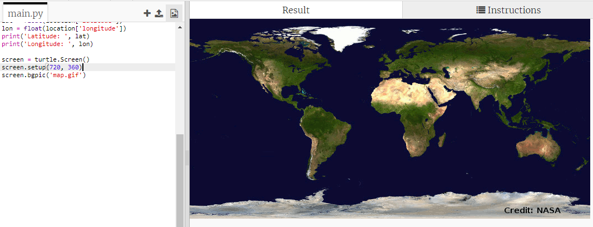

## नकाशावर ISS प्लॉट करत आहे

नकाशावर स्थान दर्शविणे उपयुक्त ठरेल. Python Turtle ग्राफिक्स वापरून आपण हे करू शकता!

+ आपल्याला प्रथम Python `turtle` लायब्ररी आयात करणे आवश्यक आहे:

+ पुढे, पार्श्वभूमी प्रतिमेच्या रुपात जागतिक नकाशा लोड करा. आपल्या trinket मध्ये यापूर्वीच 'map.gif' नावाचा एक छायाचित्र समाविष्ट आहे! नासाने हा सुंदर नकाशा प्रदान केला आहे आणि पुन्हा वापरासाठी परवानगी दिली आहे. 

`(0,0)` वर नकाशा केंद्रित आहे अक्षांश आणि रेखांश, जे आपल्याला पाहिजे तेच आहे.

+ आपल्याला प्रतिमेच्या आकाराशी जुळण्यासाठी स्क्रीन आकार सेट करणे आवश्यक आहे, जे 720 बाय 360 पिक्सेल आहे. `screen.setup(720, 360)` जोडा:

+ आपल्याला turtle एका विशिष्ट अक्षांश आणि रेखांशवर पाठविण्यात सक्षम होऊ इच्छित आहाेत. हे सुलभ करण्यासाठी आपण वापरत असलेल्या निर्देशांक जुळविण्यासाठी आपण स्क्रीन सेट करू शकता:

आता समन्वय(coordinates) अक्षांश आणि रेखांश समन्वयशी जुळतील जे वेब सेवेवरून परत येतील.

+ चला ISS साठी एक turtleचिन्ह बनवू. आपल्या trinket मध्ये ''iss.gif' आणि 'iss2.gif' समाविष्ट आहे - त्या दोघांनाही वापरून पहा आणि आपण कोणते पसंत करता ते पहा. 

[[[generic-python-turtle-image]]]

--- hints ---
 --- hint ---

आपला कोड असा दिसला पाहिजे:

--- /hint ---

--- /hints ---

+ ISS नकाशाच्या मध्यभागी प्रारंभ होतो, आता त्यास योग्य ठिकाणी हलवू:

**सूचना**: अक्षांश साधारणपणे प्रथम दिले जाते, परंतु `(x, y)` समन्वय रचताना प्रथम रेखांश देणे आवश्यक आहे.

+ आपला प्रोग्राम चालू करून याची चाचणी घ्या. ISS ने पृथ्वीवरील वरील सद्य स्थितीत जावे. 

+ काही सेकंद थांबा आणि ISS कोठे गेला आहे हे पाहण्यासाठी आपला प्रोग्राम पुन्हा चालवा.