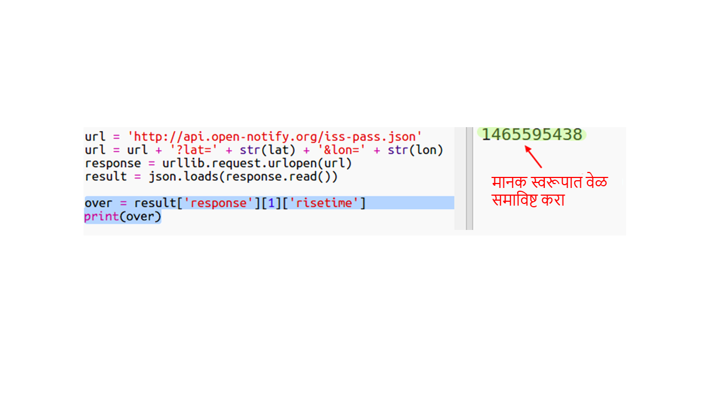
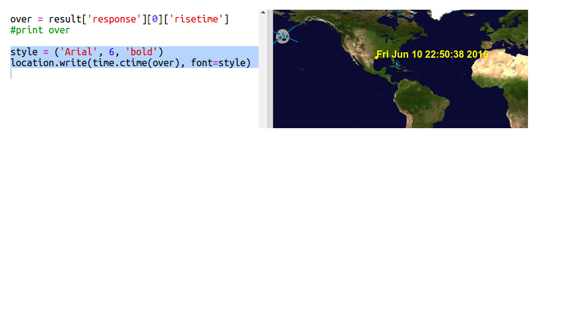

## या वरती ISS कधी असेल?

येथे एक वेब सेवा देखील आहे जी वापरूनसांगू शकतो कि ISS पुढील विशिष्ट स्थानापर्यंत केव्हा येईल.

अमेरिकेच्या ह्युस्टनमधील अक्षांश `29.5502` आणि रेखांश `95.097` वरअंतराळ केंद्रावर ISS केव्हा होईल हे जाणून घेऊया.

+ प्रथम या निर्देशांकांवर नकाशावर बिंदू प्लॉट करूया:

आता ISS ची पुढील या वरती असल्याची तारीख आणि वेळ मिळवू या.

+ पूर्वीप्रमाणे आपण वेब ब्राउझरच्या अ‍ॅड्रेस बारमध्ये त्याची URL प्रविष्ट करुन वेब सेवेला कॉल करू शकता: <a href="http://api.open-notify.org/iss-pass.json" target="_blank"> api.open-notify.org/iss-pass.json </a>

आपल्याला एक त्रुटी दिसेल:

ही वेब सेवा अक्षांश आणि रेखांश म्हणून इनपुट म्हणून घेते, म्हणून आपणास त्यांचा यूआरएलमध्ये समावेश करावा लागेल. इनपुट `?` यानंतर जोडले जातात आणि `&` सह विभक्त होतात.

+ `lat` आणि `lon` यूआरएलमध्ये <a href="http://api.open-notify.org/iss-pass.json?lat=29.55&lon=95.1" target="_blank"> api.open-notify.org/iss-pass.json?lat=29.55&lon = 95.1 </a>दर्शविल्याप्रमाणे जोडा

प्रतिसादामध्ये कित्येक पास ओव्हर वेळा समाविष्ट आहेत आणि आपण फक्त प्रथम पाहू. वेळ Unix time stamp म्हणून देण्यात आला आहे (आपण आपल्या python स्क्रिप्टमधील वाचनीय वेळेत त्यास रूपांतरित करा).

[[[generic-unix-timestamp]]]

+ आता आपल्याला Python मधून वेब सेवा कॉल करण्याची आवश्यकता आहे. आपल्या स्क्रिप्टच्या शेवटी पुढील कोड जोडा:

+ आता निकालापासून पहिला पास ओव्हर टाइम घेऊया. खालील कोड जोडा:

आपल्याला Python `time` मॉड्यूल लागेल जेणेकरून आपण ते वाचनीय स्वरूपात मुद्रित करू आणि स्थानिक वेळेत रूपांतरित करू. मग आपल्याला ह्युस्टनसाठी डॉटद्वारे पास-ओव्हर टाईम लिहिण्यासाठी स्क्रिप्ट मिळेल.

+ तुमच्या स्क्रिप्टच्या सुरवातीला `import time` ही ओळ जोडा:

+ `time.ctime()` हे फंक्शन टाईम स्टॅम्पला आपल्या नकाशावर लिहिण्या योग्य वाचन करण्यायोग्य फॉर्ममध्ये रूपांतरित करते:

(आपण `print` ओळ काढू शकता किंवा प्रारंभात `#` जोडून टिप्पणीमध्ये रूपांतरित करू शकता जेणेकरून आपली स्क्रिप्ट त्याकडे दुर्लक्ष करेल.)

+ आपल्याला आवडत असल्यास, आपण मजकूराचा रंग आणि स्वरूप बदलू शकता. 

[[[generic-python-turtle-write]]]