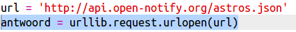
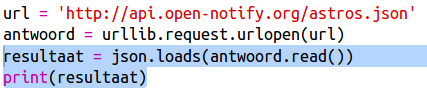
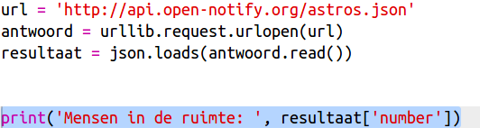
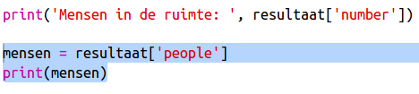
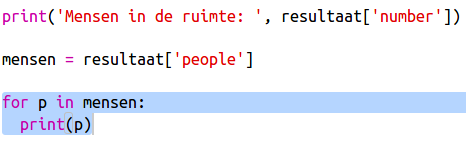

## Wie is er in de ruimte?

Je gaat een webservice gebruiken die live informatie biedt over de ruimte. Laten we eerst eens kijken wie er momenteel in de ruimte is.

Een webservice heeft een adres (URL), net als een website. In plaats van HTML voor een webpagina, stuurt het data terug.

+ Open <a href="http://api.open-notify.org/astros.json" target="_blank">de webservice</a> in een webbrowser.

Het zou er zo kunnen uitzien:

    ```
    {
      "message": "success",
      "number": 3,
      "people": [
        {
          "craft": "ISS",
          "name": "Yuri Malenchenko"
        },
        {
          "craft": "ISS",
          "name": "Timothy Kopra"
        },
        {
          "craft": "ISS",
          "name": "Timothy Peake"
        }
      ]
    }
    ```
    

De gegevens zijn live, dus je krijgt waarschijnlijk een ander resultaat. Het dataformaat heet ` JSON ` (uitgesproken als 'djeesun').

[[[generic-json]]]

Je moet de webservice met een Pythonscript oproepen om de resultaten te kunnen gebruiken.

+ Open deze trinket: <a href="http://jumpto.cc/iss-go" target="_blank">jumpto.cc/iss-go</a>.

De modules `urllib.request` en `json` zijn al geplaatst aan het begin van het `main.py` script.

+ Voeg de volgende code toe aan ` main.py ` om de URL van de webservice die je eerder hebt bezocht als een variabele op te slaan:


+ Roep nu de webservice op:



+ Nu moet je het JSON-antwoord in een Python datastructuur laden:



Het zou er zo moeten uitzien:

    {'message': 'success', 'number': 3, 'people': [{'craft': 'ISS', 'name': 'Yuri Malenchenko'}, {'craft': 'ISS', 'name': 'Timothy Kopra'}, {'craft': 'ISS', 'name': 'Timothy Peake'}]}
    

Dit is een Python woordenboek (Engels: dictionary) met drie sleutels: `message`, `number` en `people`.

[[[generic-python-key-value-pairs]]]

Het woord` message` met de waarde ` success ` geeft aan dat je met succes toegang had tot de webservice. Je zult wellicht andere waarden voor ` number ` en ` people `zien en dat hangt af wie er nu in de ruimte is.

Laten we de informatie beter leesbaar maken.

+ Bekijk het aantal mensen dat in de ruimte is en print dat:



`result['number']` zal de waarde laten zien van de sleutel `number` in het `resultaat` woordenboek. In het voorbeeld is dit ` 3 `.

+ De waarde die is gekoppeld aan de ` people ` sleutel is een lijst met woordenboeken! We plaatsen die waarde in een variabele, zodat je hem kunt gebruiken:



Je zou zoiets moeten zien:

    [{'craft': 'ISS', 'name': 'Yuri Malenchenko'}, {'craft': 'ISS', 'name': 'Timothy Kopra'}, {'craft': 'ISS', 'name': 'Timothy Peake'}]
    

+ Nu moet er voor elke astronaut een regel worden geprint. Je kunt daar een Python `for` lus voor gebruiken.

[[[generic-python-for-loop-list]]]

+ Each time through the loop, `p` will be set to a dictionary for a different astronaut.



+ You can then look up the values for `name` and `craft`. Let's show the names of the people in space:


You should see something like this:

    People in Space:  3
    Yuri Malenchenko
    Timothy Kopra
    Timothy Peake
    

**Note:** You are using live data, so your results will depend on the number of people currently in space.