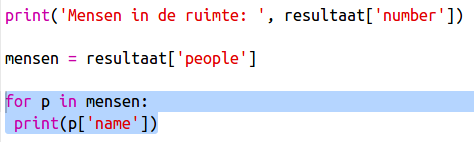

## Wie zit er in de ruimte?

U gaat een webservice gebruiken die live informatie biedt over de ruimte. Laten we eerst eens kijken wie er momenteel in de ruimte is.

+ Een webservice heeft een adres (url), net zoals een webpagina dat doet. In plaats van HTML voor een webpagina te retourneren, retourneert het gegevens.
    
    Open <a href="http://api.open-notify.org/astros.json" target="_blank">http://api.open-notify.org/astros.json</a> in een webbrowser.
    
    Je zou zoiets als dit moeten zien:
    
        {"message": "success", "number": 3, "people": [{"craft": "ISS", "name": "Yuri Malenchenko"}, {"craft": "ISS", "name ":" Timothy Kopra "}, {" craft ":" ISS "," name ":" Timothy Peake "}]}
        
    
    De gegevens zijn live, dus u ziet een ander resultaat. Het formaat wordt JSON genoemd (zeg Jason).
    
    [[[generic-json]]]

+ U moet de webservice van Python bellen zodat u de resultaten kunt gebruiken.
    
    Open deze trinket: <a href="http://jumpto.cc/iss-go" target="_blank">jumpto.cc/iss-go</a>.

+ De `urllib.request` en `json` modules zijn al voor u geïmporteerd.
    
    Voeg de volgende code toe aan `main.py` om het webadres dat u zojuist hebt gebruikt in een variabele te plaatsen:
    
    

+ Bel nu de webservice:
    
    

+ Vervolgens moet u de JSON-respons in een Python-gegevensstructuur laden:
    
    
    
    Je zou zoiets als dit moeten zien:
    
        {'message': 'success', 'number': 3, 'people': [{'craft': 'ISS', 'name': 'Yuri Malenchenko'}, {'craft': 'ISS', 'name': 'Timothy Kopra'}, {'craft': 'ISS', 'name': 'Timothy Peake'}]}
        
    
    Dit is een Python-woordenboek met 3 sleutels: bericht, nummer en mensen.
    
    [[[generic-python-key-value-pairs]]]
    
    De `succes` waarde van bericht vertelt u dat het verzoek succesvol was. Goed.
    
    Merk op dat u verschillende resultaten zult zien, afhankelijk van wie er momenteel in de ruimte is!

+ Laten we de informatie nu op een meer leesbare manier afdrukken.
    
    Laten we eerst het aantal mensen in de ruimte opzoeken en het afdrukken:
    
    
    
    `resultaat ['nummer']` drukt de waarde af die is gekoppeld aan de sleutel 'nummer' in het resultaatwoordenboek. In het voorbeeld is dit `3`.

+ De waarde die is gekoppeld aan de sleutel 'people' is een lijst met woordenboeken! Laten we die waarde in een variabele plaatsen, zodat je hem kunt gebruiken:
    
    
    
    Je zou zoiets als moeten zien:
    
        [{'craft': 'ISS', 'name': 'Yuri Malenchenko'}, {'craft': 'ISS', 'name': 'Timothy Kopra'}, {'craft': 'ISS', 'name': 'Timothy Peake'}]
        

+ Nu moet u voor elke astronaut een lijn afdrukken.
    
    Je kunt een `voor` -lus gebruiken om dit in Python te doen.
    
    [[[generic-python-for-loop-list]]]

+ Elke keer dat door de lus `p` wordt ingesteld op een woordenboek voor een andere astronaut.
    
    

+ U kunt dan de waarden opzoeken voor 'naam' en 'ambacht'. Laten we de namen van de mensen in de ruimte tonen:
    
    
    
    Je zou zoiets als moeten zien:
    
        Mensen in de ruimte: 3 Yuri Malenchenko Timothy Kopra Timothy Peake
        
    
    **U gebruikt live gegevens, zodat uw resultaten afhankelijk zijn van het aantal mensen dat zich momenteel in de ruimte bevindt.**