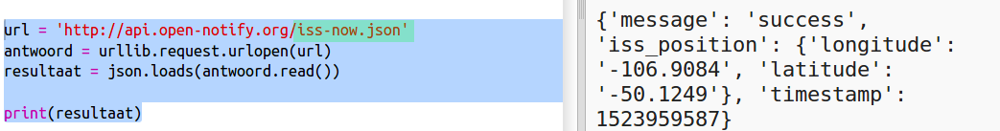
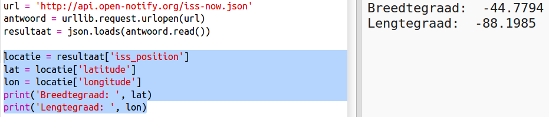

## Waar is het ISS?

Het internationale ruimtestation bevindt zich in een baan rond de aarde. Het cirkelt rond de aarde om de anderhalf uur. Het ISS reist met een gemiddelde snelheid van 7,66 km per seconde. Het is snel!

Laten we een andere webservice gebruiken om uit te zoeken waar het internationale ruimtestation ISS is.

+ Open eerst de URL voor de webservice op een nieuw tabblad in uw webbrowser: <a href="http://api.open-notify.org/iss-now.json" target="_blank">http://api.open-notify.org/iss-now.json</a>
    
    Je zou zoiets als dit moeten zien:
    
        {"iss_position": {"latitude": 8.54938193505081, "longitude": 73.16560793639105}, "message": "success", "timestamp": 1461931913}
        
    
    Het resultaat bevat de coördinaten van de plek op aarde waar het ISS momenteel is.

[[[generic-theory-lat-long]]]

+ Nu moet je dezelfde webservice vanuit Python bellen. Voeg de volgende code toe aan het einde van uw script om de huidige locatie van het ISS te krijgen:
    
    

+ Laten we variabelen maken om de breedtegraad en lengtegraad op te slaan en ze vervolgens afdrukken:
    
    