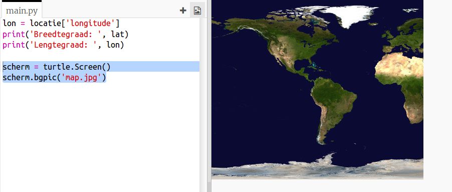
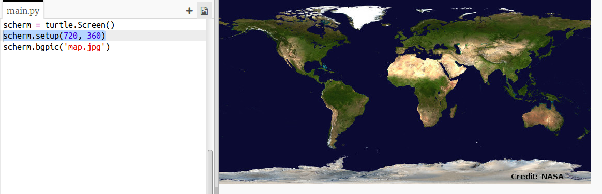
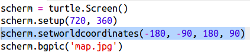
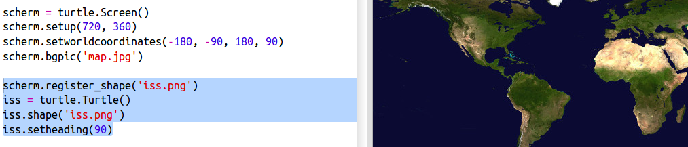
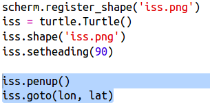
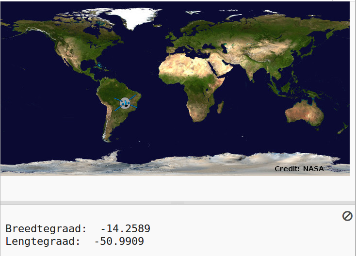

## Het ISS op een kaart tekenen

Het zou handig zijn om de positie op een kaart te tonen. Je kunt dit doen met de grafische mogelijkheden van Python Turtle.

+ Ten eerste moeten we de ` Turtle ` Python-bibliotheek importeren:

+ Laad vervolgens een wereldkaart als achtergrondafbeelding. Er is er al één in je trinket genaamd 'map.jpg'. NASA heeft deze prachtige kaart verstrekt en toestemming gegeven voor hergebruik. 

De kaart is gecentreerd op ` (0,0) ` lengte- en breedtegraad, precies wat je nodig hebt.

+ De schermgrootte moet worden ingesteld op de grootte van de afbeelding, die 720 bij 360 pixels is. Voeg ` screen.setup(720, 360) ` toe:

+ Je wilt de schildpad (Engels: turtle) naar een bepaalde lengte- en breedtegraad kunnen sturen. Om het makkelijk te maken, kunt je het scherm instellen op basis van de coördinaten die je gebruikt:

Nu komen de coördinaten overeen met de breedte- en lengtegraadcoördinaten die je terugkrijgt van de webservice.

+ Laten we een turtle-pictogram maken voor het ISS. Je trinket heeft al 'iss.png' en 'iss2.png' - probeer ze allebei en kies er een. 

[[[generic-python-turtle-image]]]

\--- hints \--- \--- hint \---

Je code zou er als volgt uit moeten zien:

\--- /hint \--- \--- /hints \---

+ Het ISS start in het midden van de kaart, we gaan het nu naar de juiste locatie verplaatsen:

** Opmerking**: normaal wordt eerst de breedtegraad (Engels: latitude) als eerste gegeven, maar om de ` (x, y) ` coördinaten te tekenen moet eerst de lengtegraad (Engels: longitude) worden opgegeven.

+ Test je programma door het uit te voeren. Het ISS zou naar de huidige locatie boven de aarde moeten gaan. 

+ Wacht een paar seconden en voer je programma opnieuw uit om te zien waar het ISS naartoe is gegaan.