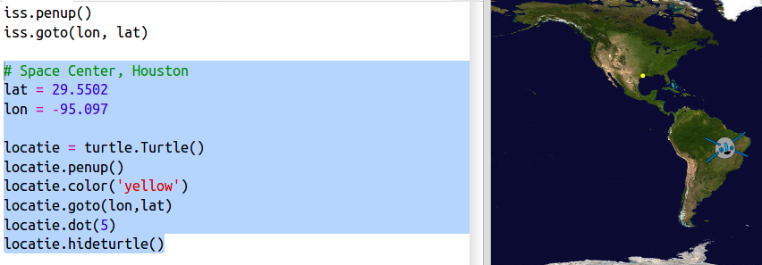
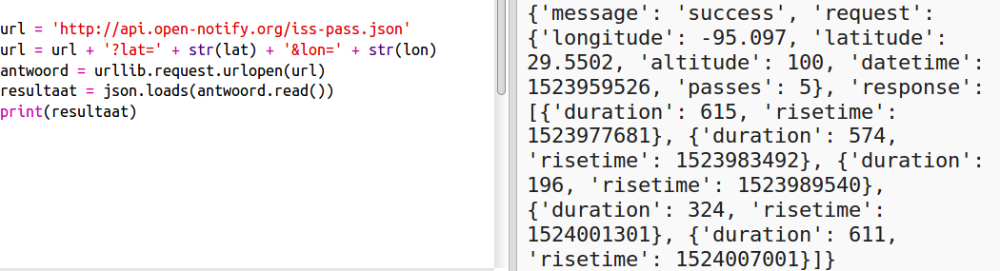
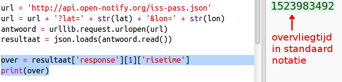
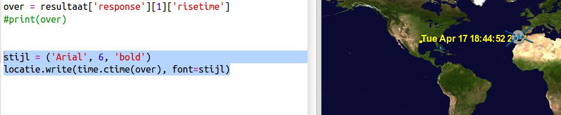

## Wanneer zal het ISS boven je hoofd zijn?

Er is ook een webservice die je kunt gebruiken om uit te zoeken wanneer het ISS boven een bepaalde locatie is.

Laten we eens uitzoeken wanneer het ISS de volgende keer boven het Space Center in Houston, VS, vliegt, op breedtegraad ` 29.5502 ` en lengtegraad ` 95.097 `.

+ We gaan eerst een punt op de kaart zetten op deze coördinaten:

Dan nemen we de datum en het tijdstip waarop het ISS er boven zal zijn.

+ Zoals eerder kunt je de webservice oproepen door de URL in te voeren in de adresbalk van een webbrowser: <a href="http://api.open-notify.org/iss-pass.json" target="_blank"> api.open-notify.org/iss-pass.json </a>

Je zou een foutmelding moeten zien:

Deze webservice neemt breedtegraad en lengtegraad als invoer, die moet dus worden opgenomen in de URL. De invoer wordt na een `? ` toegevoegd en gescheiden met `&`.

+ Voeg de ` lat ` en ` lon ` invoer toe aan de url zoals getoond: <a href="http://api.open-notify.org/iss-pass.json?lat=29.55&lon=95.1" target="_blank"> api.open-notify.org/iss-pass.json?lat=29.55&lon = 95.1 </a>

Het antwoord geeft meerdere overvliegtijden en we kijken nu alleen naar de eerste. De tijd wordt gegeven als een Unix-tijdstempel (die je kunt omzetten naar een leesbare tijd in je Python-script).

[[[generic-unix-timestamp]]]

+ Roep de webservice nu vanuit Python op. Voeg de volgende code toe aan het einde van het script:

+ Haal nu de eerste overvliegtijd uit het resultaat. Voer de volgende code in:

We hebben de Python `time` module nodig om het in een leesbare vorm te kunnen weergeven en het naar plaatselijke tijd te kunnen omzetten. Daarna krijgen we het script om de overvliegtijd voor Houston netjes weer te geven.

+ Voeg bovenaan je script de regel ` import time ` toe:

+ De `time.ctime()` functie zet de tijdstempel om naar een leesbaar formaat die je kunt weergeven op de kaart:

(Je kunt de `print` regel verwijderen of er een `#` voor zetten om de regel te negeren)

+ Als je wilt kun je de kleur en de grootte van de tekst wijzigen. 

[[[generic-python-turtle-write]]]