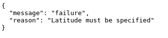

## Wanneer zal het ISS overhead zijn?

Er is ook een webservice die u kunt bellen om erachter te komen wanneer het ISS over een bepaalde locatie zal gaan.

Laten we uitzoeken wanneer het ISS het volgende zal zijn over het Space Center in Houston, VS op breedtegraad 29.5502 en op 95.097 lengtegraad.

+ Laten we eerst een punt op de kaart plotten op deze coördinaten:
    
    

+ Laten we nu de datum en het tijdstip zien waarop het ISS de volgende keer wordt overgeslagen.
    
    Net als voorheen kunnen we de webservice bellen door de URL in de adresbalk van een webbrowser in te voeren: <a href="http://api.open-notify.org/iss-pass.json" target="_blank">http://api.open-notify.org/iss-pass.json</a>
    
    U zou een foutmelding moeten zien:
    
    

+ Deze webservice neemt breedtegraad en lengtegraad als invoer, dus we moeten ze opnemen in de URL die we gebruiken.
    
    Ingangen worden toegevoegd na een `?` en gescheiden door `&`.
    
    Voeg de `lat` en `lon` invoer toe aan de url zoals getoond: <a href="http://api.open-notify.org/iss-pass.json?lat=29.55&lon=95.1" target="_blank">http://api.open-notify.org/iss-pass.json?lat=29.55&lon = 95.1</a>
    
    
    
    Het antwoord bevat verschillende doorlooptijden, we zullen alleen naar de eerste kijken. De tijd wordt gegeven als een Unix-tijdstempel, je kunt het omzetten naar een leesbare tijd in Python.

[[[generic-unix-timestamp]]]

+ Laten we nu de webservice van Python bellen. Voeg de volgende code toe aan het einde van uw script:
    
    

+ Laten we nu de eerste keer na verloop van tijd uit het resultaat halen.
    
    Voeg de volgende code toe:
    
    

+ De tijd wordt gegeven als een tijdstempel, dus we hebben de Python tijdmodule nodig zodat we deze in een leesbare vorm kunnen afdrukken en naar lokale tijd kunnen converteren. Laten we de schildpad de tijd voor de pascha per punt laten schrijven.

+ Voeg een `importtijd` regel toe aan de bovenkant van uw script:
    
    

+ De functie `time.ctime ()` converteert de tijd naar een leesbare vorm die u kunt schrijven met de schildpad:
    
    
    
    (U kunt de regel `print` verwijderen of een commentaar plaatsen.)

+ U kunt de kleur en het formaat van de tekst wijzigen als u dat wilt.

[[[generic-python-turtle-write]]]