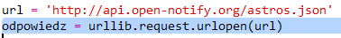
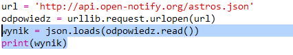
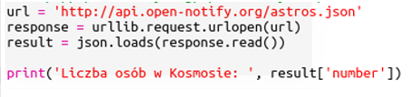
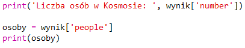
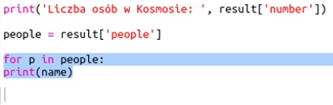
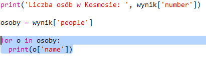

## Kto jest w kosmosie?

Użyjesz usługi internetowej, która dostarcza na bieżąco informacje o kosmosie. Najpierw dowiedzmy się, kto jest aktualnie w kosmosie.

+ Usługa internetowa ma adres (adres URL), tak jak robi to strona internetowa. Zamiast zwracania HTML dla strony internetowej zwraca dane.
    
    Otwórz <a href="http://api.open-notify.org/astros.json" target="_blank">http://api.open-notify.org/astros.json</a> w przeglądarce internetowej.
    
    Powinieneś zobaczyć coś takiego:
    
        {"message": "success", "number": 3, "people": [{"craft": "ISS", "name": "Yuri Malenchenko"}, {"craft": "ISS", "name ":" Timothy Kopra "}, {" craft ":" ISS "," name ":" Timothy Peake "}]}
        
    
    Dane są aktywne, więc zobaczysz inny wynik. Format nazywa się JSON (powiedzmy Jason).
    
    [[[generic-json]]]

+ Musisz zadzwonić do usługi internetowej z Pythona, aby móc korzystać z wyników.
    
    Otwórz tę bibelotkę: <a href="http://jumpto.cc/iss-go" target="_blank">jumpto.cc/iss-go</a>.

+ Moduły `urllib.request` i `json` zostały już zaimportowane.
    
    Dodaj następujący kod do `main.py` , aby umieścić użyty adres internetowy w zmiennej:
    
    

+ Teraz zadzwoń do serwisu internetowego:
    
    

+ Następnie musisz załadować odpowiedź JSON do struktury danych Pythona:
    
    
    
    Powinieneś zobaczyć coś takiego:
    
        {'message': 'success', 'number': 3, 'people': [{'craft': 'ISS', 'name': 'Yuri Malenchenko'}, {'craft': 'ISS', 'name': 'Timothy Kopra'}, {'craft': 'ISS', 'name': 'Timothy Peake'}]}
        
    
    Jest to słownik Pythona z trzema kluczami: wiadomością, liczbą i ludźmi.
    
    [[[generic-python-key-value-pairs]]]
    
    Wartość `sukcesu` komunikatu informuje, że żądanie się powiodło. Dobry.
    
    Zauważ, że zobaczysz różne wyniki w zależności od tego, kto jest aktualnie w kosmosie!

+ Teraz wydrukujmy te informacje w bardziej czytelny sposób.
    
    Najpierw sprawdźmy liczbę osób w przestrzeni i wydrukujmy:
    
    
    
    `result ['number']` wyświetli wartość skojarzoną z kluczem 'number' w słowniku wyników. W tym przykładzie jest `3`.

+ Wartość powiązana z kluczem "ludzie" to lista słowników! Wpiszmy tę wartość do zmiennej, abyś mógł z niej korzystać:
    
    
    
    Powinieneś zobaczyć coś takiego:
    
        [{'craft': 'ISS', 'name': 'Yuri Malenchenko'}, {'craft': 'ISS', 'name': 'Timothy Kopra'}, {'craft': 'ISS', 'name': 'Timothy Peake'}]
        

+ Teraz musisz wydrukować linię dla każdego astronauty.
    
    Możesz użyć `dla pętli` , aby to zrobić w Pythonie.
    
    [[[generic-python-for-loop-list]]]

+ Za każdym razem w pętli `p` zostanie ustawiony słownik dla innego astronauty.
    
    

+ Następnie możesz wyszukać wartości "name" i "craft". Pokażmy imiona ludzi w kosmosie:
    
    
    
    Powinieneś zobaczyć coś takiego:
    
        Ludzie w kosmosie: 3 Yuri Malenchenko Timothy Kopra Timothy Peake
        
    
    **Używasz danych na żywo, więc Twoje wyniki będą zależeć od liczby osób aktualnie przebywających w kosmosie.**