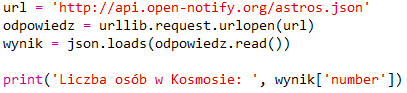
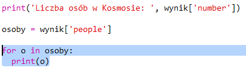

## Kto jest w kosmosie?

Użyjesz usługi sieciowej, która dostarcza na bieżąco informacje o kosmosie. Najpierw dowiedzmy się, kto jest obecnie w kosmosie.

Usługa internetowa ma adres (URL), tak jak strona internetowa. Zamiast zwracać kod HTML dla strony internetowej, zwraca dane.

+ Otwórz <a href="http://api.open-notify.org/astros.json" target="_blank">usługę sieciową</a> w przeglądarce sieci web.

Powinieneś zobaczyć coś takiego:
```
    {
      "message": "success",
      "number": 3,
      "people": [
        {
          "craft": "ISS",
          "name": "Yuri Malenchenko"
        },
        {
          "craft": "ISS",
          "name": "Timothy Kopra"
        },
        {
          "craft": "ISS",
          "name": "Timothy Peake"
        }
      ]
    }
```    

Dane są aktualizowane na żywo, więc prawdopodobnie zobaczysz nieco inny wynik. Format danych jest nazywany `JSON` (wymawiane jak "Dżejson").

[[[generic-json]]]

Musisz wywołać usługę sieciową ze skryptu w języku Python, aby móc korzystać z wyników.

+ Otwórz Trinket: <http://rpf.io/iss-on>{:target="_blank"}.

Moduły `urllib.request` i `json` zostały już zaimportowane u góry głównego pliku skryptu `main.py`.

+ Dodaj następujący kod do ` main.py ` aby przechować w zmiennej adres URL usługi sieciowej, do której właśnie miałeś dostęp:


+ Teraz wywołaj usługę sieciową:


+ Następnie musisz załadować odpowiedź JSON do struktury danych Pythona:


Powinieneś zobaczyć coś takiego:
```
    {'message': 'success', 'number': 3, 'people': [{'craft': 'ISS', 'name': 'Yuri Malenchenko'}, {'craft': 'ISS', 'name': 'Timothy Kopra'}, {'craft': 'ISS', 'name': 'Timothy Peake'}]}
```
    

Jest to słownik Pythona z trzema kluczami: `message`, `number`, oraz `people`.

[[[generic-python-key-value-pairs]]]

Ta wiadomość `message` ma wartość `success` mówi, że pomyślnie uzyskałeś dostęp do usługi sieciowej. Zauważ, że zobaczysz różne wyniki dla `number` i `people` w zależności od tego, kto jest aktualnie w kosmosie.

Teraz wyświetlmy te informacje w bardziej czytelny sposób.

+ Najpierw sprawdźmy liczbę osób w przestrzeni i wyświetlmy ją:



`wynik['number']` wyświetli wartość skojarzoną z kluczem `number` w słowniku `result`. W tym przypadku jest to `3`.

+ Wartość powiązana z kluczem `people` to lista słowników! Przypiszmy tę wartość do zmiennej, abyś mógł z niej korzystać:


Powinieneś zobaczyć coś takiego:
```
    [{'craft': 'ISS', 'name': 'Yuri Malenchenko'}, {'craft': 'ISS', 'name': 'Timothy Kopra'}, {'craft': 'ISS', 'name': 'Timothy Peake'}]
```    

+ Teraz musisz wydrukować linię dla każdego astronauty. Możesz użyć pętli `for` z Pythona do zrobienia tego.

[[[generic-python-for-loop-list]]]

+ Za każdym przejściem przez pętlę, `p` będzie ustawione na słownik dla innego astronauty.



+ Następnie możesz wyszukać wartości dla `name` i `craft`. Pokażmy imiona osób w kosmosie:


Powinieneś zobaczyć coś takiego:
```
    Liczba osób w Kosmosie:  3
    Yuri Malenchenko
    Timothy Kopra
    Timothy Peake
```    

**Uwaga:** Używasz danych na żywo, więc Twoje wyniki będą zależeć od liczby osób aktualnie przebywających w kosmosie.