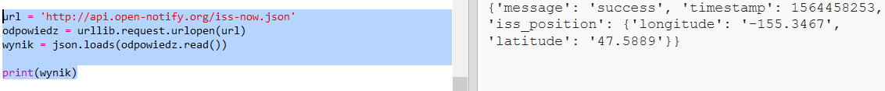
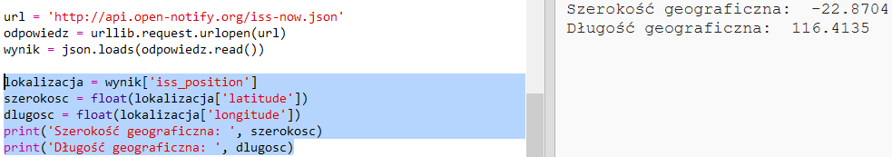

## Gdzie jest ISS?

Międzynarodowa Stacja Kosmiczna (ISS) znajduje się na orbicie okołoziemskiej. Zatacza pełną orbitę Ziemi mniej więcej co półtorej godziny i podróżuje ze średnią prędkością 7,66 km na sekundę. To szybko!

Użyjmy innej usługi sieciowej, aby dowiedzieć się, gdzie znajduje się Międzynarodowa Stacja Kosmiczna.

+ Najpierw otwórz adres URL usługi sieciowej w nowej karcie w przeglądarce: <a href="http://api.open-notify.org/iss-now.json" target="_blank">http://api.open-notify.org/iss-now.json</a>

Powinieneś zobaczyć coś takiego:

    {
    "iss_position": {
      "latitude": 8.54938193505081, 
      "longitude": 73.16560793639105
    }, 
    "message": "success", 
    "timestamp": 1461931913
    }
    

Wynik zawiera współrzędne miejsca na Ziemi, nad którym właśnie znajduje się ISS.

[[[generic-theory-lat-long]]]

+ Teraz musisz wywołać tę samą usługę sieciową z Pythona. Dodaj następujący kod na końcu skryptu, aby uzyskać bieżącą lokalizację ISS:

+ Utwórzmy zmienne do przechowywania szerokości i długości geograficznej, a następnie wyświetlmy je:

