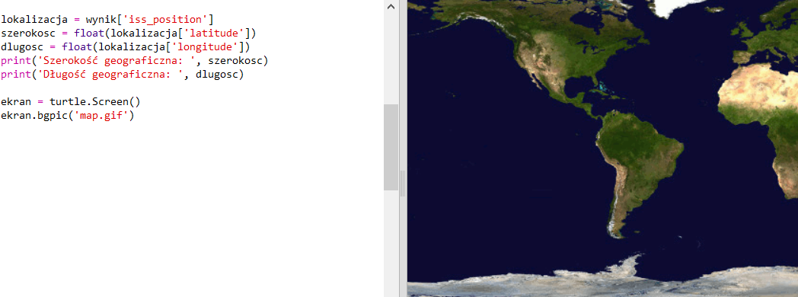
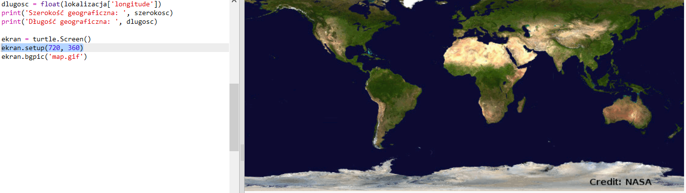
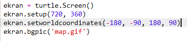
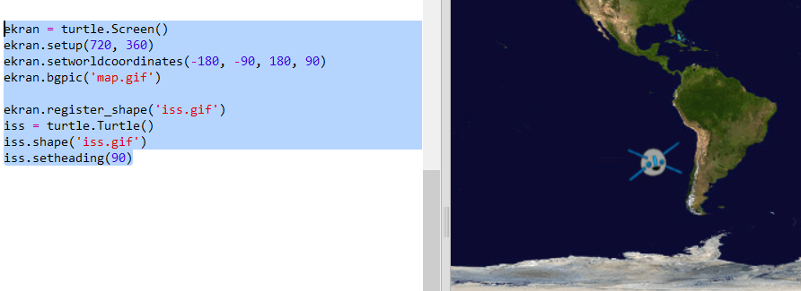
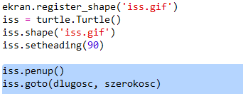

## Nanoszenie ISS na mapę

Dobrze byłoby wyświetlić pozycję na mapie. Możesz to zrobić za pomocą grafiki Python Turtle!

+ Najpierw musimy zaimportować bibliotekę `turtle` Pythona:

+ Następnie załaduj mapę świata jako tło. Jedna znajduje się już w Twoim Trinkecie, nazywa się "map.gif"! NASA dostarczyła tę piękną mapę i udzieliła pozwolenia na jej ponowne wykorzystanie. 

Mapa jest wyśrodkowana na szerokość i długość geograficzną `(0,0)`, która jest właśnie tym, czego potrzebujesz.

+ Musisz ustawić rozmiar ekranu, aby dopasować go do rozmiaru obrazu, który wynosi 720 na 360 pikseli. Dodaj `screen.setup(720, 360)`:

+ Powinieneś mieć możliwość wysłać żółwia na określoną szerokość i długość geograficzną. Aby to ułatwić, możesz ustawić ekran tak, aby pasował do współrzędnych, z których korzystasz:

Teraz współrzędne będą pasować do długości i szerokości geograficznej, które otrzymujesz z usługi internetowej.

+ Stwórzmy ikonę żółwia dla ISS. Twój trinket zawiera "iss.gif" i "iss2.gif" — wypróbuj je i sprawdź, który z nich wolisz. 

[[[generic-python-turtle-image]]]

\--- hints \--- \--- hint \---

Twój kod powinien wyglądać tak:

\--- /hint \--- \--- /hints \---

+ ISS startuje na środku mapy, a teraz przenieśmy ją do właściwej lokalizacji:

**Uwaga**: szerokość geograficzna jest zwykle podawana jako pierwsza, ale podczas wyświetlania współrzędnych `(x, y)` musimy najpierw podać długość geograficzną.

+ Sprawdź swój program, uruchamiając go. ISS powinna przejść do swojej obecnej lokalizacji nad Ziemią. 

+ Poczekaj kilka sekund i uruchom ponownie program, aby sprawdzić, gdzie przemieściła się ISS.