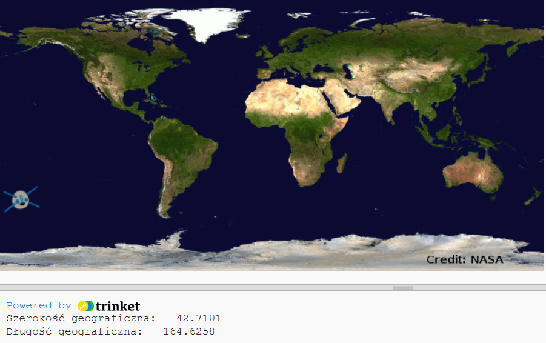

## Nanoszenie ISS na mapę

Dobrze byłoby wyświetlić pozycję na mapie. Możesz to zrobić za pomocą grafiki Python Turtle!

+ Najpierw musimy zaimportować bibliotekę `turtle` Pythona:

+ Następnie załaduj mapę świata jako tło. There’s one already included in your trinket called 'map.gif'! NASA dostarczyła tę piękną mapę i udzieliła pozwolenia na jej ponowne wykorzystanie. 

Mapa jest wyśrodkowana na `(0,0)` szerokość i długość geograficzna, która jest właśnie tym, czego potrzebujesz.

+ Musisz ustawić rozmiar ekranu, aby dopasować go do rozmiaru obrazu, który wynosi 720 na 360 pikseli. Dodaj `screen.setup(720, 360)`:

+ Chcesz móc wysłać żółwia na określoną szerokość i długość geograficzną. Aby to ułatwić, możesz ustawić ekran tak, aby pasował do współrzędnych, z których korzystasz:

Teraz współrzędne będą pasować do długości i szerokości geograficznej, które otrzymujesz z powrotem od usługi internetowej.

+ Stwórzmy ikonę żółwia dla ISS. Your trinket includes 'iss.gif' and 'iss2.gif' — try them both and see which one you prefer. 

[[[generic-python-turtle-image]]]

\--- hints \--- \--- hint \---

Twój plik powinien teraz wyglądać tak:

\--- /hint \--- \--- /hints \---

+ ISS zaczyna się w środku mapy, a teraz przenieśmy ją do właściwej lokalizacji:

**Uwaga**: szerokość geograficzna jest zwykle podawana jako pierwsza, ale musimy najpierw podać długość geograficzną podczas wyświetlania współrzędnych `(x, y)`.

+ Sprawdź swój program, uruchamiając go. ISS powinna przejść do swojej obecnej lokalizacji nad Ziemią. 

+ Poczekaj kilka sekund i uruchom ponownie program, aby sprawdzić, do którego miejsca trafiła usługa ISS.