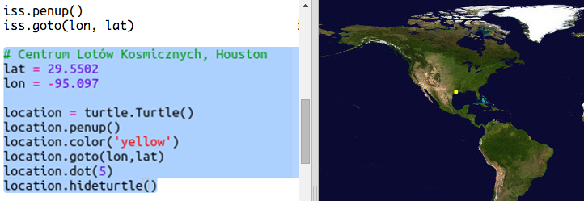
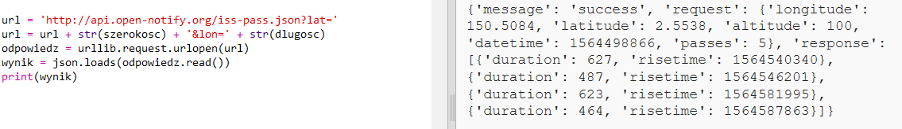
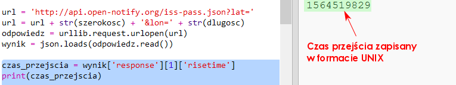
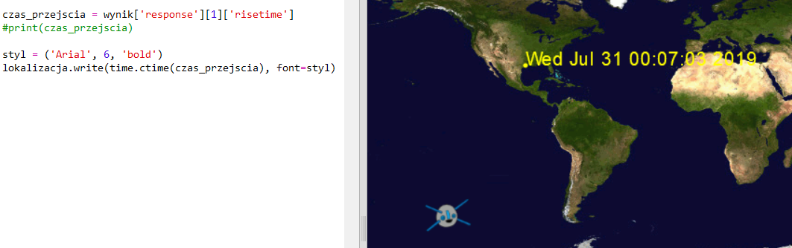

## Kiedy ISS będzie nad głową?

Istnieje również usługa sieciowa, za pomocą której można dowiedzieć się, kiedy usługa ISS będzie nad danym miejscem.

Zobaczmy, kiedy ISS będzie następny nad Centrum Lotów Kosmicznym w Houston, USA, na szerokości geograficznej `29.5502` i długość geograficzna `95,097`.

+ Najpierw narysuj kropkę na mapie o tych współrzędnych:

Teraz pobierzmy datę i godzinę, kiedy ISS będzie następnym razem powyżej.

+ Tak jak poprzednio, możesz wywołać usługę sieciową, wpisując jej adres URL w pasku adresu przeglądarki internetowej: <a href="http://api.open-notify.org/iss-pass.json" target="_blank">api.open-notify.org/iss-pass.json</a>

Powinien pojawić się błąd:

Ta usługa sieciowa ma długość i szerokość geograficzną jako dane wejściowe, więc musisz uwzględnić je w adresie URL. Wejścia są dodawane po `?` i oddzielone przez `&`.

+ Dodaj dane wejściowe ` lat ` i ` lon ` do adresu url, jak pokazano: <a href="http://api.open-notify.org/iss-pass.json?lat=29.55&lon=95.1" target="_blank">api.open-notify.org/iss-pass.json?lat=29.55&lon = 95.1</a>

Odpowiedź zawiera kilka czasów przejścia i przyjrzymy się pierwszej z nich. Czas podany jest w Unixowym zapisie czasu ( będziesz mieć możliwość konwersji na czytelny zapis czasu w skrypcie Pythona).

[[[generic-unix-timestamp]]]

+ Teraz musisz wywołać tę samą usługę sieciową z Pythona. Dodaj następujący kod na końcu skryptu:

+ Teraz weźmy z wyników pierwszy czas przejścia. Dodaj następujący kod:

Będziemy potrzebować w Pythonie moduł `czasu`, abyśmy mogli wydrukować go w czytelnej formie i przekonwertować go na czas lokalny. Potem otrzymamy skrypt do zapisu czasu przejazdu przez kropkę dla Houston.

+ Dodaj linię z instrukcją `import time` na początku skryptu:

+ Funkcja`time.ctime()` przekształci datownik w czytelną formę, którą można zapisać na mapie:

(Możesz usunąć linię z `print`, albo zamienić ją w komentarz dodając `#` na początku skryptu aby był ignorowany.)

+ Jeśli chcesz, możesz zmienić kolor i format tekstu. 

[[[generic-python-turtle-write]]]