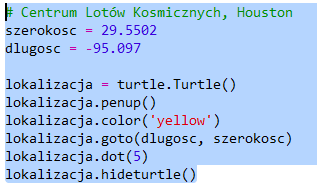

## Kiedy ISS będzie nad głową?

Istnieje również usługa sieciowa, za pomocą której można dowiedzieć się, kiedy ISS będzie nad danym miejscem.

Zobaczmy, kiedy ISS będzie następny raz nad Centrum Lotów Kosmicznych w Houston, w Stanach Zjednoczonych, na szerokości geograficznej `29.5502` i długości geograficznej `95,097`.

+ Najpierw narysuj kropkę na mapie o tych współrzędnych:

Teraz pobierzmy datę i godzinę, kiedy ISS będzie następnym razem nad Houston.

+ Tak jak poprzednio, możesz wywołać usługę sieciową, wpisując jej adres URL w pasku adresu przeglądarki internetowej: <a href="http://api.open-notify.org/iss-pass.json" target="_blank">api.open-notify.org/iss-pass.json</a>

Powinien pojawić się błąd:

Ta usługa sieciowa ma długość i szerokość geograficzną jako dane wejściowe, więc musisz uwzględnić je w adresie URL. Dane wejściowe są dodawane po `?` i oddzielane przez `&`.

+ Dodaj parametry `szerokosc` (lat) i `dlugosc` (lon) do adresu url w ten sposób: <a href="http://api.open-notify.org/iss-pass.json?lat=29.55&lon=95.1" target="_blank">api.open-notify.org/iss-pass.json?lat=29.55&lon=95.1</a>

Odpowiedź zawiera kilka czasów przejścia, przyjrzyjmy się pierwszemu z nich. Czas jest podany jako uniksowy znacznik czasu (będziesz mógł przekonwertować go na czytelny format czasu w skrypcie Pythona).

[[[generic-unix-timestamp]]]

+ Teraz musisz wywołać tę samą usługę sieciową z Pythona. Dodaj następujący kod na końcu skryptu:

+ Teraz weźmy z wyników pierwszy czas przejścia. Dodaj następujący kod:

Będziemy potrzebować w Pythonie moduł `time`, abyśmy mogli wyświetlić czas w czytelnym formacie i przekonwertować go na czas lokalny. Potem otrzymamy skrypt do zapisu czasu przejścia nad kropką dla Houston.

+ Dodaj linię z instrukcją `import time` na początku skryptu:

+ Funkcja`time.ctime()` przekształci znacznik czasu w czytelny format, który można zapisać na mapie:

(Możesz usunąć linię z `print`, albo zamienić ją w komentarz dodając `#` na początku skryptu aby był ignorowany.)

+ Jeśli chcesz, możesz zmienić kolor i format tekstu. 

[[[generic-python-turtle-write]]]