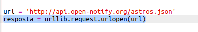
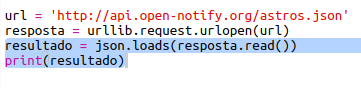
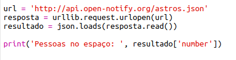
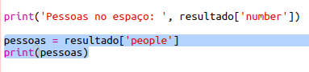
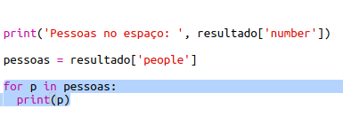
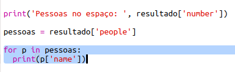

## Quem está no espaço?

Você vai usar um serviço da web que fornece informações em tempo real sobre o espaço. Primeiro, vamos descobrir quem está no espaço atualmente.

Um serviço da web tem um endereço (URL) exatamente como um site tem. Em vez de retornar HTML para uma página da Web, ele retorna dados.

+ Abra <a href="http://api.open-notify.org/astros.json" target="_blank">o serviço da web</a> em um navegador da web.

Você deverá ver algo assim:

    {
      "message": "success",
      "number": 3,
      "people": [
        {
          "craft": "ISS",
          "name": "Yuri Malenchenko"
        },
        {
          "craft": "ISS",
          "name": "Timothy Kopra"
        },
        {
          "craft": "ISS",
          "name": "Timothy Peake"
        }
      ]
    }
    

Os dados são atualizados em tempo real, então você provavelmente verá um resultado ligeiramente diferente. O formato dos dados é chamado de `JSON` (pronunciado como "Jason").

[[[generic-json]]]

Você precisa chamar o serviço da web a partir de um script Python, para poder usar os resultados.

+ Open this trinket: <http://rpf.io/iss-on>{:target="_blank"}.

Os módulos `urllib.request` e `json` já foram importados para você na parte superior do script `main.py`.

+ Adicione o seguinte código a `main.py` para armazenar a URL do serviço web que você acabou de acessar como uma variável:

+ Agora chame o serviço da web:

+ Em seguida, você precisará carregar a resposta JSON em uma estrutura de dados em Python:

Você deverá ver algo assim:

    {'message': 'success', 'number': 3, 'people': [{'craft': 'ISS', 'name': 'Yuri Malenchenko'}, {'craft': 'ISS', 'name': 'Timothy Kopra'}, {'craft': 'ISS', 'name': 'Timothy Peake'}]}
    

Este é um dicionário Python com três chaves: `message`, `number` e `people`.

[[[generic-python-key-value-pairs]]]

A `message` que tem o valor `success` mostra que você acessou com sucesso o serviço da web. Observe que você verá resultados diferentes para `number` e `people` dependendo de quem está no espaço.

Agora vamos imprimir as informações de uma maneira mais legível.

+ Primeiro, vamos procurar o número de pessoas no espaço e imprimi-lo:

`resultado ['number']` imprimirá o valor associado à chave `number` no dicionário `resultado`. No exemplo, isso é `3`.

+ O valor associado à chave `people` é uma lista de dicionários! Vamos colocar esse valor em uma variável para que você possa usá-lo:

Você deverá ver algo assim:

    [{'craft': 'ISS', 'name': 'Yuri Malenchenko'}, {'craft': 'ISS', 'name': 'Timothy Kopra'}, {'craft': 'ISS', 'name': 'Timothy Peake'}]
    

+ Agora você precisa imprimir uma linha para cada astronauta. Você pode usar um laço de repetição `for` do Python para fazer isso.

[[[generic-python-for-loop-list]]]

+ Cada vez através do loop, `p` será definido como um dicionário para um astronauta diferente.

+ Você pode então procurar os valores para o `name` e `craft`. Vamos mostrar os nomes das pessoas no espaço:

Você deverá ver algo assim:

    Pessoas no Espaço: 3
    Yuri Malenchenko
    Timothy Kopra
    Timothy Peake
    

**Nota:** Você está usando dados atualizados, então os seus resultados dependerão do número de pessoas atualmente no espaço.