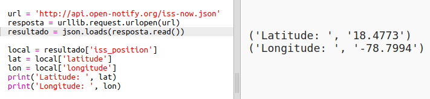

## Onde está a ISS?

A Estação Espacial Internacional está em órbita ao redor da Terra. Ela completa uma órbita da Terra aproximadamente a cada uma hora e meia, e viaja a uma velocidade média de 7,66 km por segundo. É rápida!

Vamos usar outro serviço da web para descobrir onde está a Estação Espacial Internacional.

+ Primeiro, abra a URL do serviço da Web em uma nova guia no navegador da Web: <a href="http://api.open-notify.org/iss-now.json" target="_blank">http://api.open-notify.org/iss-now.json</a>

Você deveria ver algo assim:

    {"iss_position": {"latitude": 8.54938193505081, "longitude": 73.16560793639105}, "message": "success", "timestamp": 1461931913}
    

O resultado contém as coordenadas do ponto na Terra em que a ISS está no momento.

[[[generic-theory-lat-long]]]

+ Agora você precisa chamar o mesmo serviço da Web no Python. Adicione o seguinte código ao final do seu script para obter a localização atual da ISS:

+ Vamos criar variáveis ​​para armazenar a latitude e a longitude e depois imprimi-las:

