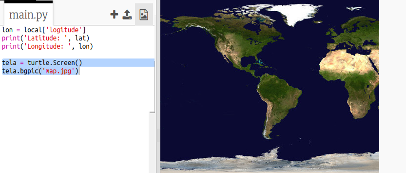
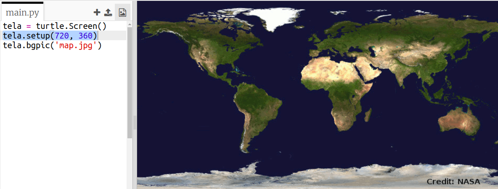
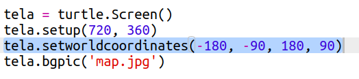
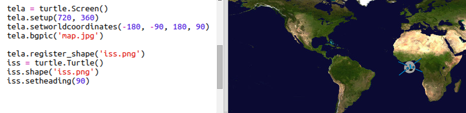
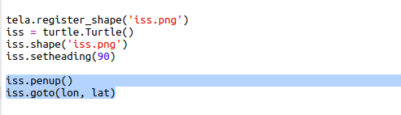
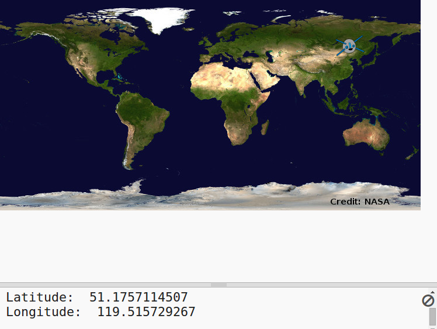

## Localizando a ISS em um mapa

Seria útil mostrar a posição em um mapa. Você pode fazer isso usando a Python Turtle!

+ Primeiro, precisaremos importar a biblioteca `turtle` no Python:

+ Em seguida, carregue um mapa mundi como imagem de fundo. Há um mapa mundi incluído no seu trinket chamado 'map.jpg'! A NASA forneceu este belo mapa e deu permissão para reutilização. 

O mapa é centrado em latitude e longitude `(0,0)`, exatamente o que você precisa.

+ Você precisa definir o tamanho da tela para corresponder ao tamanho da imagem, que é de 720 por 360 pixels. Adicione `tela.setup (720, 360)`:

+ Você precisa enviar a turtle para coordenadas(latitude e longitude) específicas. Para facilitar, você pode definir a tela para corresponder às coordenadas que você está usando:

Agora as coordenadas corresponderão às coordenadas de latitude e longitude que você recebe de volta do serviço da web.

+ Vamos criar um ícone turtle para a ISS. Seu trinket inclui 'iss.png' e 'iss2.png' - experimente os dois e veja qual você prefere. 

[[[generic-python-turtle-image]]]

\--- hints \--- \--- hint \---

Seu código deve ficar assim:

\--- /hint \--- \--- /hints \---

+ A ISS começa no centro do mapa, agora vamos movê-la para o local correto:

**Nota**: a latitude normalmente é dada primeiro, mas precisamos dar a longitude primeiro ao plotar as coordenadas `(x, y)`.

+ Teste seu programa executando-o. A ISS deve se mover para sua localização atual acima da Terra. 

+ Aguarde alguns segundos e execute seu programa novamente para ver para onde a ISS se moveu.