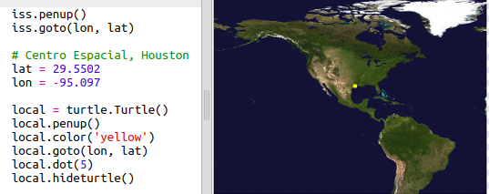
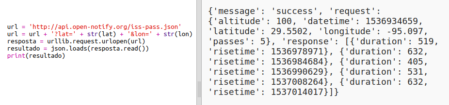
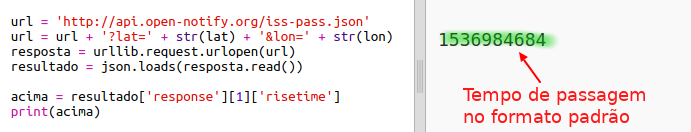
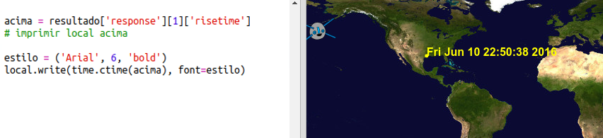

## Quando a ISS estará logo acima?

Há também um serviço da Web que você pode usar para descobrir quando a ISS estará em um determinado local.

Vamos descobrir quando a ISS estará acima do Centro Espacial em Houston, EUA, que está na latitude `29.5502` e longitude `95.097`.

+ Primeiro, vamos traçar um ponto no mapa nessas coordenadas:

Agora vamos pegar a data e a hora em que a ISS estará logo acima novamente.

+ Como antes, você pode chamar o serviço da Web digitando sua URL na barra de endereços de um navegador da Web: <a href="http://api.open-notify.org/iss-pass.json" target="_blank">api.open-notify.org/iss-pass.json</a>

Você deve ver um erro:

Esse serviço da web usa latitude e longitude como entradas, portanto, você deve incluí-los na URL. Entradas são adicionadas após um `?` e separados por `&`.

+ Adicione as entradas `lat` e `lon` à URL como mostrado: <a href="http://api.open-notify.org/iss-pass.json?lat=29.55&lon=95.1" target="_blank">api.open-notify.org/iss-pass.json?lat=29.55&lon = 95.1</a>

A resposta inclui vários tempos de passagem, e vamos ver apenas o primeiro. A hora é dada como um registro de data / hora do Unix (você poderá convertê-lo em um tempo legível em seu script Python).

[[[generic-unix-timestamp]]]

+ Agora vamos chamar o serviço da web do Python. Adicione o seguinte código ao final do seu script:

+ Agora vamos obter o primeiro tempo de passagem do resultado. Adicione o seguinte código:

Vamos precisar do módulo Python `time` para que possamos imprimi-lo de forma legível e convertê-lo para a hora local. Então nós vamos fazer com que o script escreva o tempo de passagem do lado do ponto para Houston.

+ Adicione uma linha de `import time` na parte superior do seu script:

+ A função `time.ctime ()` converterá o registro de data e hora em um formato legível que você pode gravar em seu mapa:

(Você pode remover a linha `print`, ou transformá-la em um comentário, adicionando `#` no início, assim o seu script irá ignorá-la.)

+ Se preferir, você pode alterar a cor e o formato do texto. 

[[[generic-python-turtle-write]]]