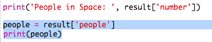

## Quem está no espaço?

Vais usar um serviço da web que fornece informações ao vivo sobre o espaço. Primeiro, vamos descobrir quem está atualmente no espaço.

Um serviço web tem um endereço (URL) assim como um site tem. Em vez de retornar HTML para uma página da Web, ele retorna dados.

+ Abre <a href="http://api.open-notify.org/astros.json" target="_blank">o serviço da web</a> num navegador da web.

Deves ver algo parecido com isto:

    {
      "message": "success",
      "number": 3,
      "people": [
        {
          "craft": "ISS",
          "name": "Yuri Malenchenko"
        },
        {
          "craft": "ISS",
          "name": "Timothy Kopra"
        },
        {
          "craft": "ISS",
          "name": "Timothy Peake"
        }
      ]
    }
    

Os dados são ao vivo, então você provavelmente verá um resultado ligeiramente diferente. O formato de dados é chamado de `JSON` (pronunciado como "Jason").

[[[generic-json]]]

Você precisa chamar o serviço da web a partir de um script Python, para poder usar os resultados.

+ Abrir este trinket: <http://rpf.io/iss-on>{:target="_blank"}.

Os módulos `urllib.request` e `json` já foram importados para você na parte superior do script `main.py`.

+ Adicione o seguinte código a `main.py` para armazenar o URL do serviço web que você acabou de acessar como uma variável:

+ Agora ligue para o serviço da web:

+ De seguida, vais necessitar carregar a resposta JSON em uma estrutura de dados Python:

Você deveria ver algo assim:

    {'message': 'success', 'number': 3, 'people': [{'craft': 'ISS', 'name': 'Yuri Malenchenko'}, {'craft': 'ISS', 'name': 'Timothy Kopra'}, {'craft': 'ISS', 'name': 'Timothy Peake'}]}
    

Este é um dicionário Python com três chaves: `, mensagem`, `número`e `pessoas`.

[[[generic-python-key-value-pairs]]]

Que `mensagem` tem o valor `sucesso` diz que você acessou com sucesso o serviço web. Observe que você verá resultados diferentes para `número` e `pessoas` dependendo de quem está no espaço.

Agora vamos imprimir as informações de uma maneira mais legível.

+ Primeiro, vamos procurar o número de pessoas no espaço e imprimi-lo:

`resultado ['número']` imprimirá o valor associado à chave `número` no `resultado` dicionário. No exemplo, isso é `3`.

+ O valor associado à chave `pessoas` é uma lista de dicionários! Vamos colocar esse valor em uma variável para que você possa usá-lo:

Você deveria ver algo como:

    [{'craft': 'ISS', 'name': 'Yuri Malenchenko'}, {'craft': 'ISS', 'name': 'Timothy Kopra'}, {'craft': 'ISS', 'name': 'Timothy Peake'}]
    

+ Agora você precisa imprimir uma linha para cada astronauta. Você pode usar um loop `do Python para` para fazer isso.

[[[generic-python-for-loop-list]]]

+ Cada vez através do loop, `p` será definido como um dicionário para um astronauta diferente.

+ Você pode então procurar os valores para o `nome` e `ofício`. Vamos mostrar os nomes das pessoas no espaço:

Você deveria ver algo assim:

    Pessoas no Espaço: 3 Yuri Malenchenko Timothy Kopra Timothy Peake
    

**Nota:** Você está usando dados ao vivo, então seus resultados dependerão do número de pessoas atualmente no espaço.