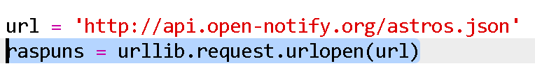
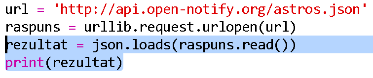
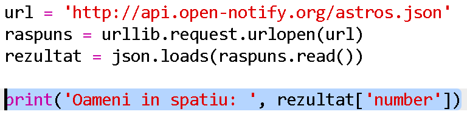
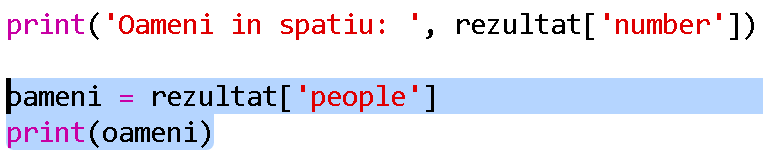
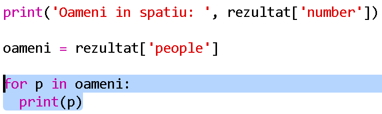
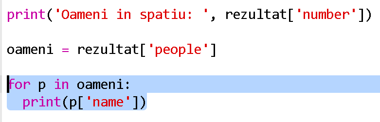

## Cine este în spațiu?

Vei folosi un serviciu web care oferă informații in timp real despre spațiu. Mai întâi, să aflăm cine este în prezent în spațiu.

Un serviciu web are o adresă (URL) la fel cum are un site web. În loc să returneze HTML pentru o pagină web, returnează date.

+ Deschide <a href="http://api.open-notify.org/astros.json" target="_blank"> serviciul web </a> într-un browser web.

Ar trebui să vezi ceva ca mai jos:

    {
      "message": "success",
      "number": 3,
      "people": [
        {
          "craft": "ISS",
          "name": "Yuri Malenchenko"
        },
        {
          "craft": "ISS",
          "name": "Timothy Kopra"
        },
        {
          "craft": "ISS",
          "name": "Timothy Peake"
        }
      ]
    }
    

Datele sunt în timp real, așa că vei vedea probabil un rezultat ușor diferit. Formatul de date se numește ` JSON ` (pronunțat „Jason”).

[[[generic-json]]]

Trebuie să apelezi serviciul web dintr-un script Python pentru a putea utiliza rezultatele.

+ Deschide acest trinket: <http://rpf.io/iss-on>{:target="_blank"}.

Modulele ` urllib.request ` și ` json ` au fost deja importate pentru tine la începutul script-ului ` main.py `.

+ Adaugă următorul cod în ` main.py ` pentru a stoca într-o variabilă adresa URL a serviciului web pe care tocmai l-ai accesat:

+ Acum invocă serviciul web:

+ În continuare, trebuie să încarci răspunsul JSON într-o structură de date Python:

Ar trebui să vezi ceva ca mai jos:

    {'message': 'success', 'number': 3, 'people': [{'craft': 'ISS', 'name': 'Yuri Malenchenko'}, {'craft': 'ISS', 'name': 'Timothy Kopra'}, {'craft': 'ISS', 'name': 'Timothy Peake'}]}
    

Acesta este un dicționar Python cu trei chei: ` message (mesaj)`, ` number(număr)` și ` people(oameni)`.

[[[generic-python-key-value-pairs]]]

Acel mesaj ` ` cu valoarea ` success(succes) ` îți spune că ai accesat cu succes serviciul web. Reține că vei vedea rezultate diferite pentru ` număr ` și ` oameni ` în funcție de cine se află în prezent în spațiu.

Acum, să tipărim informațiile într-un mod mai lizibil.

+ Mai întâi, să căutăm numărul de persoane în spațiu și să îl tipărim:

` rezultat [ 'număr'] ` va tipări valoarea asociată cu cheia`numar ` în dicţionarul `rezultat`. În exemplu, aceasta este ` 3 `.

+ Valoarea asociată cu cheia `people` este o listă de dicționare! Să punem această valoare într-o variabilă, astfel încât să o poți folosi:

Ar trebui să vezi ceva ca mai jos:

    [{'craft': 'ISS', 'name': 'Yuri Malenchenko'}, {'craft': 'ISS', 'name': 'Timothy Kopra'}, {'craft': 'ISS', 'name': 'Timothy Peake'}]
    

+ Acum trebuie să imprimi o linie pentru fiecare astronaut. Poți folosi o structură repetitivă ` for` din Python pentru a face acest lucru.

[[[generic-python-for-loop-list]]]

+ De fiecare dată cand se executa bucla, ` p ` va primi valoarea unui dicționar pentru un alt astronaut.

+ Poți căuta apoi valorile pentru ` nume ` și ` meșteșug `. Să arătăm numele persoanelor din spațiu:

Ar trebui să vezi ceva ca mai jos:

    People in Space:  3
    Yuri Malenchenko
    Timothy Kopra
    Timothy Peake
    

** Notă: ** Utilizați date actualizate în timp real, astfel încât rezultatele dvs. vor depinde de numărul de persoane care se află în prezent în spațiu.