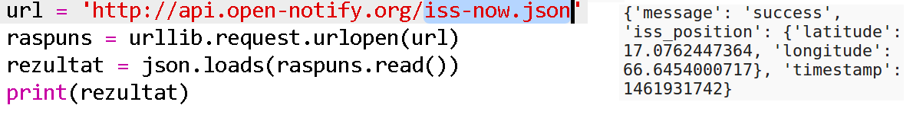
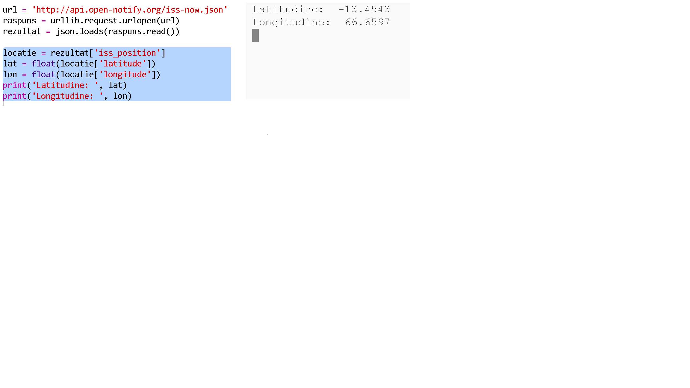

## Unde este SSI?

Stația Spațială Internațională este pe orbită în jurul Pământului. It completes an orbit of the earth roughly every hour and a half, and travels at an average speed of 7.66 km per second. It’s fast!

Let’s use another web service to find out where the International Space Station is.

+ First open the URL for the web service in a new tab in your web browser: <a href="http://api.open-notify.org/iss-now.json" target="_blank">http://api.open-notify.org/iss-now.json</a>

You should see something like this:

    {
    "iss_position": {
      "latitude": 8.54938193505081, 
      "longitude": 73.16560793639105
    }, 
    "message": "success", 
    "timestamp": 1461931913
    }
    

The result contains the coordinates of the spot on Earth that the ISS is currently over.

[[[generic-theory-lat-long]]]

+ Now you need to call the same web service from Python. Add the following code to the end of your script to get the current location of the ISS:

+ Let’s create variables to store the latitude and longitude, and then print them:

