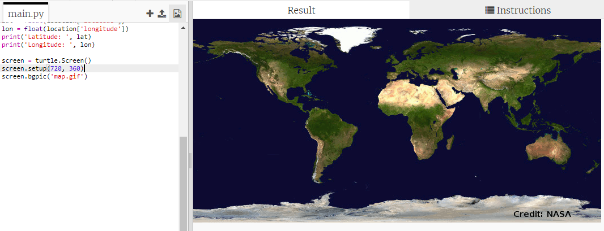

## Reprezentarea SSI pe o hartă

Ar fi util să se afișeze poziția pe o hartă. Poți face acest lucru folosind Python Turtle!

+ Mai întâi va trebui să importăm librăria Python ` turtle `:

+ În continuare, încarcă o hartă a lumii ca imagine de fundal. Există una deja inclusă în trinket numită „map.gif”! NASA a oferit această frumoasă hartă și a acordat permisiunea pentru refolosire. 

Harta este centrată la ` (0,0) ` latitudine și longitudine, care este exact ceea ce ai nevoie.

+ Trebuie să setezi dimensiunea ecranului pentru a se potrivi cu dimensiunea imaginii, care este de 720 pe 360 de pixeli. Adaugă ` ecran.setup (720, 360) `:

+ Vrei să poți trimite testoasa la o anumită latitudine și longitudine. Pentru a face acest lucru ușor, poți seta ecranul să corespundă coordonatelor pe care le utilizezi:

Acum, coordonatele se vor potrivi cu coordonatele de latitudine și longitudine pe care le returneaza serviciul web.

+ Hai să creăm o pictogramă turtle pentru SSI. Trinket-ul tău include „iss.gif” și „iss2.gif” - încearcă-le pe amândouă și vezi pe care o preferi. 

[generic-python-turtle-image]

\--- hints \--- \--- hint \---

Codul tău ar trebui să arate astfel:

\--- /hint \---

\--- /hints \---

+ SSI pornește din centrul hărții, acum să o mutăm în locația corectă:

** Notă **: în mod normal, latitudinea este dată mai întâi, dar trebuie să dăm longitudinea mai întâi atunci când se reprezintă coordonatele ` (x, y) `.

+ Testează-ți programul rulându-l. SSI ar trebui să se mute la poziția sa actuală deasupra Pământului. 

+ Așteaptă câteva secunde și execută programul din nou pentru a vedea unde s-a mutat SSI.