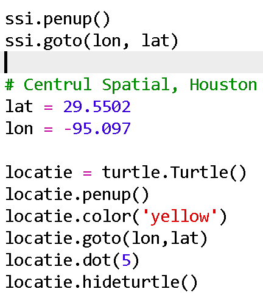
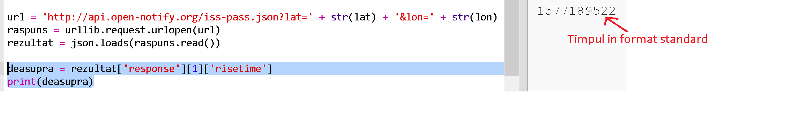
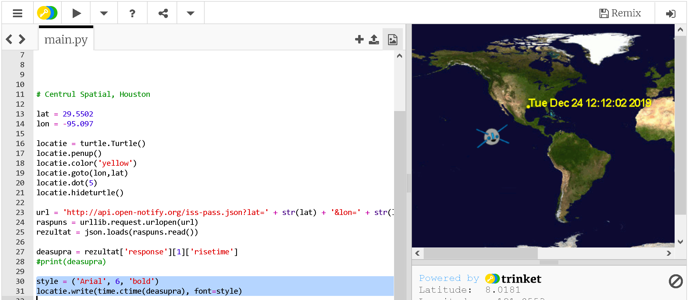

## Când va fi SSI deasupra?

Există, de asemenea, un serviciu web pe care îl poți folosi pentru a afla când SSI va fi ulterior deasupra unei anumite locații.

Să aflăm când SSI va fi ulterior peste Centrul Spațial din Houston, SUA, care se află la latitudinea ` 29.5502 ` și longitudinea ` 95.097 `.

+ În primul rând, să desenăm un punct pe hartă la aceste coordonate:

Acum, să obținem data și ora la care SSI este deasupra.

+ Ca și până acum, puteți apela serviciul web introducând URL-ul său în bara de adrese a unui browser web: <a href="http://api.open-notify.org/iss-pass.json" target="_blank"> api.open-notify.org/iss-pass.json </a>

Ar trebui să vezi o eroare:

Acest serviciu web ia latitudinea și longitudinea ca parametri de intrare, deci trebuie să le incluzi în adresa URL. Intrările sunt adăugate după un `? ` și separate prin `&`.

+ Adaugă parametrii ` lat ` și ` lon ` la url după cum urmează: <a href="http://api.open-notify.org/iss-pass.json?lat=29.55&lon=95.1" target="_blank"> api.open-notify.org/iss-pass.json?lat=29.55&lon = 95.1 </a>

Răspunsul include mai multe perioade cand a trecut pe deasupra și ne vom uita doar la prima. Timpul este oferit sub forma unei mărci temporale Unix (vei putea să-l convertesti la o oră lizibilă în scriptul tău Python).

[generic-unix-timestamp]

+ Acum trebuie să apelezi același serviciu web din Python. Adaugă următorul cod la sfârșitul scriptului:

+ Acum să obținem primul moment de trecere pe deasupra din rezultat. Adaugă următorul cod:

Vom avea nevoie de modulul Python ` time `, astfel încât să-l putem tipări într-o formă care poate fi citită și să-l convertim la ora locală. Apoi, vom primi script-ul pentru a scrie timpul de trecere deasupra punctului pentru Houston.

+ Adaugă o linie `import time` in partea de sus a scriptului:

+ Funcția ` time.ctime () ` va converti marca temporală într-o formă care poate fi citită pe care o poți scrie pe harta ta:

(Poți elimina imprimarea liniei `print` sau să o transformi într-un comentariu adăugând ` # ` la început, astfel încât scriptul să o ignore.)

+ Dacă vrei, poți modifica culoarea și formatul textului. 

[generic-python-turtle-write]