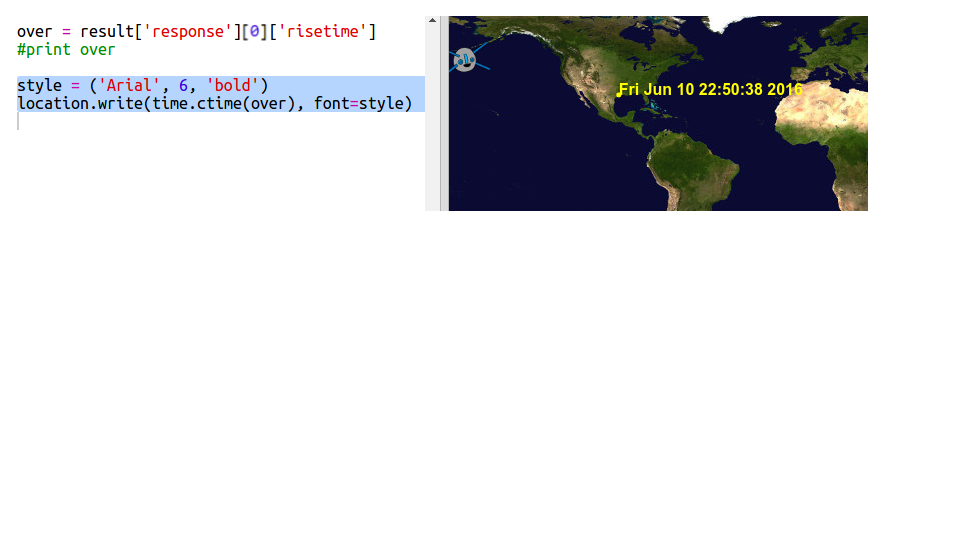

## Când va fi SSI deasupra?

Există, de asemenea, un serviciu web pe care îl poți folosi pentru a afla când SSI va fi ulterior deasupra unei anumite locații.

Să aflăm când SSI va fi ulterior peste Centrul Spațial din Houston, SUA, care se află la latitudinea ` 29.5502 ` și longitudinea ` 95.097 `.

+ În primul rând, să desenăm un punct pe hartă la aceste coordonate:

Acum, să obținem data și ora la care SSI este deasupra.

+ Ca și până acum, puteți apela serviciul web introducând URL-ul său în bara de adrese a unui browser web: <a href="http://api.open-notify.org/iss-pass.json" target="_blank"> api.open-notify.org/iss-pass.json </a>

Ar trebui să vezi o eroare:

Acest serviciu web ia latitudinea și longitudinea ca parametri de intrare, deci trebuie să le incluzi în adresa URL. Intrările sunt adăugate după un `? ` și separate prin `&`.

+ Adaugă parametrii ` lat ` și ` lon ` la url după cum urmează: <a href="http://api.open-notify.org/iss-pass.json?lat=29.55&lon=95.1" target="_blank"> api.open-notify.org/iss-pass.json?lat=29.55&lon = 95.1 </a>

Răspunsul include mai multe perioade cand a trecut pe deasupra și ne vom uita doar la prima. Timpul este oferit sub forma unei mărci temporale Unix (vei putea să-l convertesti la o oră lizibilă în scriptul tău Python).

[generic-unix-timestamp]

+ Acum trebuie să apelezi același serviciu web din Python. Adaugă următorul cod la sfârșitul scriptului:

+ Now let's get the first pass-over time from the result. Add the following code:

We’ll need the Python `time` module so we can print it in a readable form and convert it to local time. Then we'll get the script to write the pass-over time by the dot for Houston.

+ Add an `import time` line at the top of your script:

+ The `time.ctime()` function will convert the time stamp to a readable form that you can write onto your map:

(You can remove the `print` line, or turn it into a comment by adding `#` at the start so your script will ignore it.)

+ If you like, you can change the colour and format of the text. 

[[[generic-python-turtle-write]]]