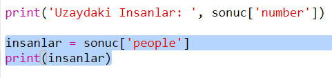
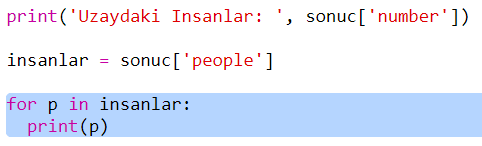

## Uzayda kim var?

Uzay hakkında anlık bilgi sağlayan bir web hizmeti kullanacaksınız. İlk olarak, şu anda kimin uzayda olduğunu bulalım.

Bir web hizmetinin, tıpkı bir web sitesi gibi bir adresi (URL) vardır. Web sayfası için HTML yerine, veri sağlar.

+ Bir internet tarayıcısında <a href="http://api.open-notify.org/astros.json" target="_blank">web hizmetini</a> açın.

Aşağıdakine benzer bir şey görmelisiniz:

    {
      "message": "success",
      "number": 3,
      "people": [
        {
          "craft": "ISS",
          "name": "Yuri Malenchenko"
        },
        {
          "craft": "ISS",
          "name": "Timothy Kopra"
        },
        {
          "craft": "ISS",
          "name": "Timothy Peake"
        }
      ]
    }
    

Veri anlık, bu yüzden muhtemelen biraz farklı bir sonuç göreceksiniz. Bu veri formatına `JSON` denir ('ceysın' olarak telafuz edilir).

[[[generic-json]]]

Bir Python scriptinden web hizmetini çağırmalısınız, böylece sonuçları kullanabilirsiniz.

+ Bu trinket'i açın: <http://rpf.io/iss-on>{:target="_blank"}.

`urllib.request` ve `json` modülleri `main.py`'nin en üstünde sizin için içe aktarıldı.

+ Aşağıdaki kodu az önce değişken olarak eriştiğiniz web servisinin adresini(URL) saklamak için `main.py`'ye ekleyin:

+ Şimdi web servisini çağırın:

+ Sonra JSON yanıtını bir Python veri yapısına yüklemelisiniz:

Aşağıdakine benzer bir şey görmelisiniz:

    {'message': 'success', 'number': 3, 'people': [{'craft': 'ISS', 'name': 'Yuri Malenchenko'}, {'craft': 'ISS', 'name': 'Timothy Kopra'}, {'craft': 'ISS', 'name': 'Timothy Peake'}]}
    

Bu üç anahtarlı bir Python sözlüğüdür: `message`, `number`, and `people`.

[[[generic-python-key-value-pairs]]]

`success` değerine sahip `message` size başarılı bir şekilde web hizmetine eriştiğinizi söyler. Şu anda uzayda bulunan kişi sayısına bağlı olarak `number` ve `people` için farklı sonuçlar görüceğinizi not edin.

Şimdi bilgileri daha okunabilir bir şekilde yazdıralım.

+ İlk olarak, uzaydaki insan sayısını görelim ve yazdıralım:

`sonuc['number']` `sonuc` sözlüğünde bulunan `number` anahtarına bağlı değeri yazdıracaktır. Örnekte, bu `3`.

+ `people` anahtarıyla ilişkili değer sözlüklerin bir listesi! Bu değeri bir değişkene koyalım, böylece onu kullanabilirsiniz:

Aşağıdakine benzer bir şey görmelisiniz:

    [{'craft': 'ISS', 'name': 'Yuri Malenchenko'}, {'craft': 'ISS', 'name': 'Timothy Kopra'}, {'craft': 'ISS', 'name': 'Timothy Peake'}]
    

+ Şimdi her astronot için bir satır yazdırmanız gerekiyor. Bunu için bir Python `for` döngüsü kullanabilirsiniz.

[[[generic-python-for-loop-list]]]

+ Döngü boyunca her seferinde `p` farklı bir astronot için sözlüğe ayarlanacaktır.

+ Sonrasında `name` ve `craft` için değerlere bakabilirsiniz. Uzaydaki insanların isimlerini gösterelim:

Aşağıdakine benzer bir şey görmelisiniz:

    Uzaydaki Insanlar: 3
    Yuri Malenchenko
    Timothy Kopra
    Timothy Peake
    

**Not:** Anlık veri kullanıyorsunuz, bu yüzden sonuçlarınız şu anda uzayda olan kişi sayısına bağlı olacaktır.