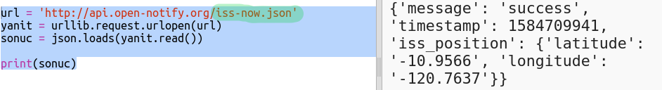

## ISS nerede?

Uluslararası Uzay İstasyonu Dünyanın yörüngesinde bulunuyor. Kabaca her bir buçuk saatte dünyanın yörüngesinin etrafında bir tur atar ve yaklaşık olarak saniyede 7.66 km bir hızda seyreder. Oldukça hızlı!

Hadi Uluslararası Uzay İstasyonu'nun yerini bulmak için başka bir web hizmeti kullanalım.

+ Önce web hizmetinin URL'sini web tarayıcınızda yeni bir sekmede açın: <a href="http://api.open-notify.org/iss-now.json" target="_blank"> http://api.open-notify.org/iss-now.json </a>

Aşağıdakine benzer bir şey görmelisiniz:

    {
    "iss_position": {
      "latitude": 8.54938193505081, 
      "longitude": 73.16560793639105
    }, 
    "message": "success", 
    "timestamp": 1461931913
    }
    

Sonuç, şu anda ISS'nin Dünya üzerinde bulunduğu yerin koordinatlarını içerir.

[[[generic-theory-lat-long]]]

+ Şimdi aynı web servisini Python'da çağırmalısınız. ISS'nin geçerli konumunu bulmak için scriptinizin sonuna aşağıdaki kodu ekleyin:

+ Enlem ve boylamı saklamak için değişkenler oluşturalım ve bunları yazdıralım:

