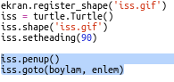

## ISS'yi harita üzerinde gösterme

ISS'nin konumunu haritada göstermek faydalı olabilir. Bunu Python Turtle grafiklerini kullanarak yapabilirsiniz!

+ Öncelikle Python `turtle` kütüphanesini içe aktarmalıyız:

+ Ardından, arka plan görüntüsü olarak bir dünya haritası yükleyin. Trinketinizde zaten 'map.gif' adında bir tane var! NASA bu güzel haritayı sağladı ve yeniden kullanım için izin verdi. 

Harita `(0,0)` enlem ve boylamda ortalanmıştır, tam da ihtiyacınız olan şey bu.

+ Ekran boyutunu, 720 x 360 piksel olan görüntünün boyutuna uyacak şekilde ayarlamanız gerekli. `ekran.setup(720, 360)`'ı Ekleyin:

+ Turtle'ı belirli bir enlem ve boylama gönderebilmek isteyebilirsiniz. Bunu kolaylaştırmak için, ekranı kullandığınız koordinatlara uyacak şekilde ayarlayabilirsiniz:

Şimdi koordinatlar, web hizmetinden aldığınız enlem ve boylam ile eşleşecektir.

+ ISS için bir turtlesimgesi oluşturalım. Trinketinizde 'iss.gif' ve 'iss2.gif' adlı iki ikon içeriyor - ikisini de deneyin ve hangisini kullanmak istediğinizi seçin. 

[[[generic-python-turtle-image]]]

--- hints ---
 --- hint ---

Kodunuz şöyle görünmeli:

--- /hint ---

--- /hints ---

+ ISS haritanın ortasında başlıyor, şimdi doğru yere taşıyalım:

**Not**: Enlem normal olarak önce gelir, ancak `(x, y)`'yi gösterirken öncelikle boylam gelir.

+ Programınızı çalıştırarak(run) test edin. ISS, Dünya üzerindeki mevcut konumuna gitmelidir. 

+ Birkaç saniye bekleyin ve ISS'nin nereye gittiğini görmek için programınızı tekrar çalıştırın(run).