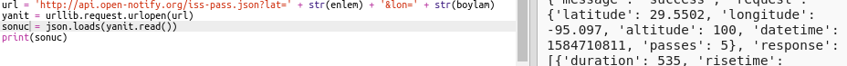

## ISS ne zaman üstümüzde olacak?

ISS'nin belirli bir konumun üzerinde ne zaman bulunacağını öğrenmek için kullanabileceğiniz bir web hizmeti de vardır.

ISS'nin bir dahaki sefer ne zaman enlemi `29.5502` ve boylamı `95.097` olan Houston, ABD'deki Space Centre'ın üzerinden geçeceğini bulalım.

+ Önce harita üzerinde şu koordinatları kullanarak bir noktayı gösterelim:

Şimdi ISS'nin bir sonraki üzerimizde olduğu tarihi ve saati alalım.

+ Daha önce olduğu gibi, URL'sini bir web tarayıcısının adres çubuğuna girerek web hizmetini çağırabilirsiniz: <a href="http://api.open-notify.org/iss-pass.json" target="_blank">api.open-notify.org/iss-pass.json</a>

Bir hata görmelisiniz:

Bu web hizmeti enlem ve boylamı girdi olarak alır, bu nedenle bunları URL'ye eklemeniz gerekir. Girdiler `?`'dan sonra eklenir ve `&` ile ayrılır.

+ Gösterildiği gibi `enlem`(lat) ve `boylam`(lon) girdilerini URL ye girin: <a href="http://api.open-notify.org/iss-pass.json?lat=29.55&lon=95.1" target="_blank">api.open-notify.org/iss-pass.json?lat=29.55&lon=95.1</a>

Yanıt birkaç geçiş süresi içeriyor ve biz sadece ilkine bakacağız. Zaman bir Unix zaman damgası olarak verildi (Python scriptinizde okunabilir bir zamana dönüştürebilirsiniz).

[[[generic-unix-timestamp]]]

+ Şimdi web servisini Python'da çağıralım. Scriptinizin sonuna aşağıdaki kodu ekleyin:

+ Şimdi sonuçtan ilk geçiş zamanını alalım. Aşağıdaki kodu ekleyin:

Python `time` modülüne ihtiyacımız olacak, böylece onu okunabilir bir biçimde yazdırıp yerel saate dönüştürebiliriz. Sonra scriptin Houston için geçiş zamanını yazdırmasını sağlıycağız.

+ Scriptinizin en üstüne bu `import time` satırını ekleyin:

+ `time.ctime()` fonksiyonu zaman damgasını haritanıza yazabileceğiniz okunabilir bir forma dönüştürür:

(`print` satırını kaldırabilirsiniz, veya başına `#` ekleyerek scriptinizin onu görmezden gelmesini sağlayabilirsiniz)

+ İsterseniz metnin rengini ve biçimini değiştirebilirsiniz. 

[[[generic-python-turtle-write]]]