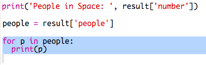

## Хто в космосі?

Ви збираєтеся використовувати веб-службу, яка надає живу інформацію про простір. По-перше, давайте дізнаємося, хто зараз знаходиться в просторі.

Веб-служба має адресу (URL), подібну до веб-сайту. Замість повернення HTML для веб-сторінки, він повертає дані.

+ Відкрийте <a href="http://api.open-notify.org/astros.json" target="_blank">веб-службу</a> у веб-переглядачі.

Ви повинні побачити щось на зразок цього:

    "{{" ремесло ":" МКС "," назва ":" Юрій Маленченко "}, {" ремесло ":" МКС " , "ім'я": "Тимофій Копра"}, {"ремесло": "МКС", "назва": "Тимофій Пік"}]} `` `
    

Дані є живими, тому ви, мабуть, побачите трохи інший результат. Формат даних називається `JSON` (вимовляється як "Джейсон").

[[[generic-json]]]

Вам потрібно зателефонувати до веб-сервера за допомогою сценарію Python, щоб ви могли використовувати результати.

+ Відкрийте цю дрібницю: <a href="http://jumpto.cc/iss-go" target="_blank">jumpto.cc/iss-go</a>.

Модулі `urllib.request` та `json` вже імпортовані для вас у верхній частині сценарію `main.py`.

+ Додайте наступний код до `main.py` , щоб зберегти URL-адресу веб-сервісу, який ви лише переглянули як змінну:

+ Зателефонуйте на веб-службу:

+ Next you need to load the JSON response into a Python data structure:

Ви повинні побачити щось на зразок цього:

    {'message': 'success', 'number': 3, 'people': [{'craft': 'ISS', 'name': 'Yuri Malenchenko'}, {'craft': 'ISS', 'name': 'Timothy Kopra'}, {'craft': 'ISS', 'name': 'Timothy Peake'}]}
    

Це словник Python з трьома клавішами: `повідомлення`, `число`і `осіб`.

[[[generic-python-key-value-pairs]]]

Це `повідомлення` має значення `успіх` повідомляє, що ви успішно звернулися до веб-служби. Зверніть увагу, що ви побачите різні результати для `числа` і `осіб` залежно від того, хто зараз знаходиться в просторі.

Тепер давайте роздрукуємо інформацію більш читабельним способом.

+ По-перше, давайте шукати кількість людей у ​​просторі та надрукувати їх:

`результат ['number']` надрукує значення, пов'язане з ключем `номер` у словнику `результат`. У прикладі це `3`.

+ Значення, пов'язане з ключем `осіб` , - це список словників! Давайте помістимо це значення в змінну, щоб ви могли його використовувати:

Ви повинні побачити щось на зразок:

    [{'craft': 'ISS', 'name': 'Yuri Malenchenko'}, {'craft': 'ISS', 'name': 'Timothy Kopra'}, {'craft': 'ISS', 'name': 'Timothy Peake'}]
    

+ Тепер вам потрібно роздрукувати рядок для кожного космонавта. Для цього ви можете використовувати Python `для циклу`.

[[[generic-python-for-loop-list]]]

+ Кожного разу за циклом `p` буде встановлено словник для іншого космонавта.

+ Тоді ви можете знайти значення для `назви` та `корабля`. Давайте покажемо імена людей у ​​просторі:

Ви повинні побачити щось на зразок цього:

    Люди в космосі: 3 Юрій Маленченко Тимофій Копра Тимофій Пік
    

**Примітка:** Ви використовуєте живі дані, тому ваші результати будуть залежати від кількості людей, які наразі знаходяться в просторі.