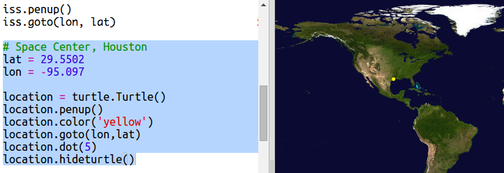

## Коли буде МКС бути накладними?

Існує також веб-сервіс, який ви можете використовувати, щоб дізнатись, коли МКС буде поруч із певним місцезнаходженням.

Давайте з'ясуємо, коли МКС буде поруч з космічним центром в Х'юстоні, США, який знаходиться на широті `29.5502` та довготи `95.097`.

+ Спочатку давайте накреслимо точку на карті в цих координатах:

Тепер давайте отримаємо дату та час, коли МКС буде наступним накладним.

+ Як і раніше, ви можете зателефонувати до веб-сервісу, ввівши його URL-адресу в адресний рядок веб-переглядача: <a href="http://api.open-notify.org/iss-pass.json" target="_blank">api.open-notify.org/iss-pass.json</a>

Ви повинні побачити помилку:

Цей веб-сервіс приймає широту та довготу в якості вхідних даних, тому ви повинні включити їх у URL-адресу. Входи додаються після `?` і розділений з `&`.

+ Додайте `лат` та `вхідні` в URL-адресу, як показано на малюнку: <a href="http://api.open-notify.org/iss-pass.json?lat=29.55&lon=95.1" target="_blank">api.open-notify.org/iss-pass.json?lat=29.55&lon = 95.1</a>

Відповідь включає в себе кілька переходів, і ми просто подивимося на перший. Час надається як часовий штамп Unix (ви зможете конвертувати його в читаний час у вашому сценарії Python).

[generic-unix-timestamp]

+ Тепер давайте називати веб-службу Python. Додайте наступний код до кінця вашого сценарію:

+ Тепер давайте отримаємо перший проміжок часу від результату. Додайте наступний код:

Нам буде потрібен модуль Python `, модуль` , щоб ми могли його надрукувати у зручному для читання вигляді та конвертувати його в місцевий час. Тоді ми отримаємо скрипт, щоб написати час проходження через точку для Х'юстона.

+ Додайте `час імпорту` у верхній частині вашого сценарію:

+ Функція `time.ctime ()` перетворить часову печатку на читабельну форму, яку ви можете написати на карту:

(Ви можете видалити рядок `print` або перетворити його на коментар, додавши `#` на початку, щоб ваш сценарій його ігнорував.)

+ Якщо вам подобається, ви можете змінити колір і формат тексту. 

[[[generic-python-turtle-write]]]