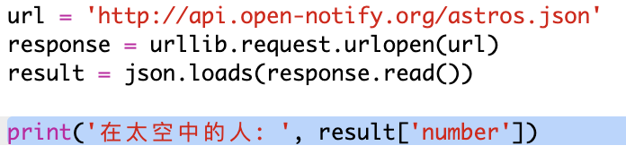
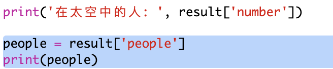
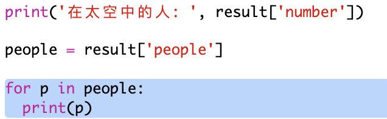
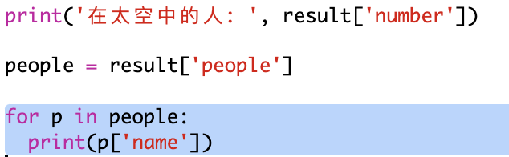

## 谁在太空里？

你将使用一项提供有关太空实时信息的 web 服务。让我们找出目前谁身处太空。 


+ web 服务就像网页一样，有一个地址 (url)。但它并不传回网页的 HTML，而是传回数据。 

    在网页浏览器中打开 <a href="http://api.open-notify.org/astros.json" target="_blank">http://api.open-notify.org/astros.json</a>。 

    你会看到类似于下文的内容：

    ```
    {
      "message": "success", 
      "number": 3, 
      "people": [
        {
          "craft": "ISS", 
          "name": "Yuri Malenchenko"
        }, 
        {
          "craft": "ISS", 
          "name": "Timothy Kopra"
        }, 
        {
          "craft": "ISS", 
          "name": "Timothy Peake"
        }
      ]
    }
    ```

    这些数据是实时的，因此你会看到不同的结果。这种格式被称作 JSON（念 Jason）。 

+ 让我们从 Python 调用该 web 服务，这样我们便可以使用该结果。

    打开这个 trinket：<a href="http://jumpto.cc/iss-go" target="_blank">jumpto.cc/iss-go</a>。 

+ 已经为你导入了 `urllib.request` 和 `json` 模块。 

    向 `main.py` 添加以下代码来将你刚刚使用的 web 地址放入一个变量中：

    
   
+ 现在让我们来调用 web 服务：

    


+ 接下来你需要将 JSON 响应结果加载到 Python 数据结构中：

    


    你会看到类似于下文的内容：

    ```
   
    ```

    这是一个有 3 个键的 Python 字典：message（信息）、number（数量）和 people（人物）。 

    信息的“success”（成功）值告诉你请求成功。很好。 

    请注意你会看到不同的结果，具体取决于目前谁在太空中！

+ 现在让我们以更具可读性的方式打印出该信息。 

    首先，让我们找到太空中的人数并将其打印出来：
  
    

    `result['number']` 将会打印与结果字典中的键“number”（数量）相关的值。示例中这个值为 `3`。 

+ 与“people”（人物）键相关的值是字典列表！让我们把这个值放入变量中，以供你使用：

    


    你会看到类似于下文的内容： 
    
    ```
    []
    ```

+ 现在你需要针对每个宇航员打印出一行。

    你可以在 Python 中使用一个 for 循环来进行操作。每执行一次循环，都将为一名不同的宇航员将 `p` 设置到一个字典。

    

+ 随后你可以查找“name”（名称）和“craft”（飞行器）的值

    
  
    你会看到类似于下文的内容：

    ```
    People in Space:  3
    Yuri Malenchenko
    Timothy Kopra
    Timothy Peake
    ```

    你正使用实时数据，因此你的结果将取决于目前在太空中的人数。 


