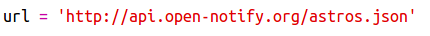
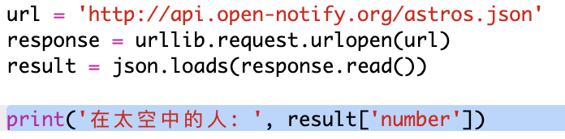
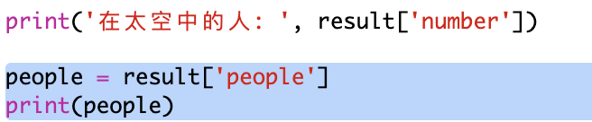
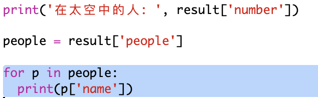

## 谁在太空中？

你将会使用一种提供有关太空的实时信息的网络服务。 首先，让我们找出目前谁在太空中。

网页服务有一个地址 (URL) ，就像网站的网址一样。 它返回的不是HTML网页 ，而是数据。

+ 在浏览器中打开 <a href="http://api.open-notify.org/astros.json" target="_blank">网页服务</a>。

你应该看到类似下面的内容：

    {
      "message": "sucess",
      "number": 3,
      "people": [
        {
          "craft": "国际空间站",
          "name": "尤里·马伦琴科"
        },
        {
          "craft": "国际空间站",
          "name": "蒂莫西·科普拉"
        },
        {
          "craft": "国际空间站",
          "name": "蒂莫西·皮克"
        }
      ]
    }
    

数据是实时的，因此你可能会看到略微不同的结果。 数据格式被称为` JSON ` （发音类似“杰森”）。

[[[generic-json]]]

你需要从Python脚本调用网页服务，以便使用结果。

+ 打开这个示例 trinket： <http://rpf.io/iss-on>{:target="_blank"}.

`urllib.request`和`json`模块已经在`main.py`脚本的开头导入。

+ 将以下代码添加到`main.py`以将你刚刚访问的网页服务的URL存储为变量：

+ 现在调用网页服务：

+ 接下来你需要将 JSON 响应加载到 Python 数据结构中：

你应该看到类似下面的内容：

    {'message': 'success', 'number': 3, 'people': [{'craft': '国际空间站', 'name': '尤里·马伦琴科'}, {'craft': '国际空间站', 'name': '蒂莫西·科普拉'}, {'craft': '国际空间站', 'name': '蒂莫西·皮克'}]}
    

这是有三个键（key）的Python字典结构：`message`（消息） ，`number`（数量）和`people` （人）。

[[[generic-python-key-value-pairs]]]

`message`的值为`success`（成功）表示你已成功访问网页服务。 请注意，根据当前在太空中的人，你将看到`number`和`people`的不同结果。

现在，让我们以更具可读性的方式打印这些信息。

+ 首先，让我们查找空间站的人数并打印：

`result['number']`将打印与`result`字典中的`number`键相匹配的值。 在这个例子中，这个数字是`3`。

+ 与`people`键对应的值是由字典结构构成的列表！ 让我们将该值放入一个变量中，以便使用它：

你应该看到类似下面的内容：

    [{'craft': '国际空间站', 'name': '尤里 马连琴科'}， {'craft': '国际空间站', 'name': '蒂莫西·科普拉'}， {'craft': '国际空间站', 'name': '蒂莫西·皮克'}]}
    

+ 现在，您需要为每位宇航员打印一行。 您可以使用 Python `for` 循环来做这件事。

[[[generic-python-for-loop-list]]]

+ 每次经过循环，`p`将被设置为不同宇航员的字典结构。

+ 然后您可以查找`name`和`craft`的值。 让我们展示一下在太空中人们的名字：

你应该看到类似下面的内容：

    太空中的人：3
    尤里·马伦琴科
    蒂莫西·科普拉
    蒂莫西·皮克
    

**注意：** 您正在使用实时数据，所以您的结果将取决于当前在太空中的人数。