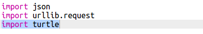
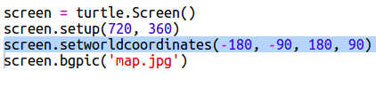
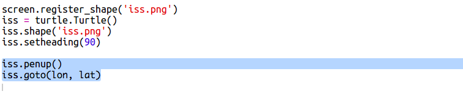
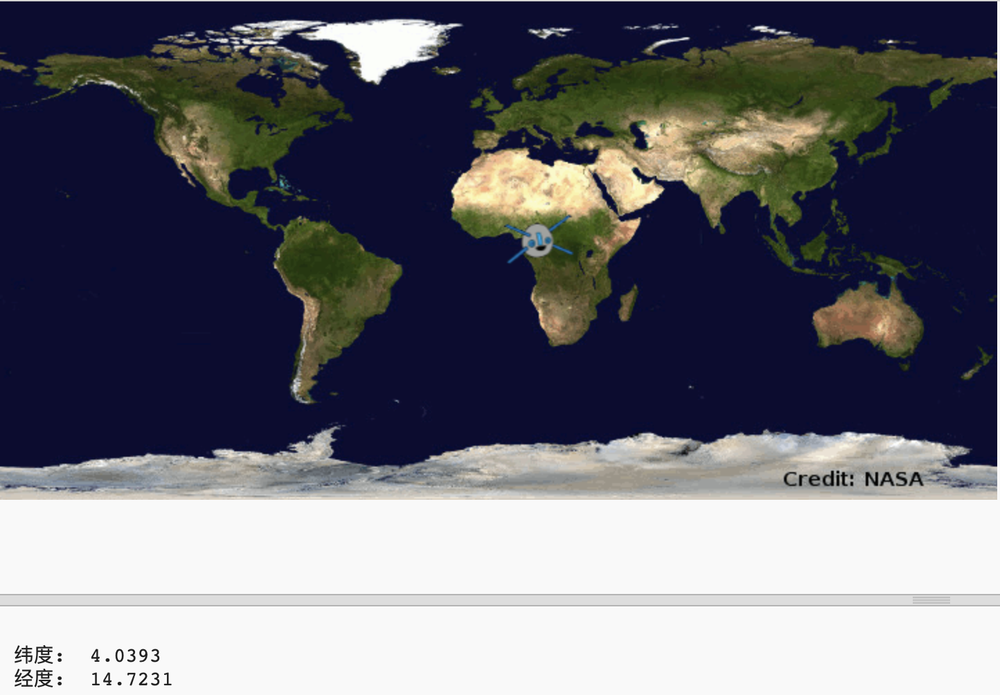

​## ISS 在哪里？

国际空间站处于环绕地球的轨道内。它每隔大约一个半小时绕地球运行一周。ISS 以平均每秒 7.66 km 的速度运行。速度很快！ 

让我们使用另一个 web 服务来查找国际空间站的位置。 


+ 首先在 web 浏览器的新选项卡中打开该 web 服务的 url：<a href="http://api.open-notify.org/iss-now.json" target="_blank">http://api.open-notify.org/iss-now.json</a>
  
    你会看到类似于下文的内容：
  
    ```
    {
    "iss_position": {
      "latitude": 8.54938193505081, 
      "longitude": 73.16560793639105
    }, 
    "message": "success", 
    "timestamp": 1461931913
    }
    ```
  
    该结果包含 ISS 当前所处位置投影到地球上的点的坐标。 

    经度是东-西位置，范围是 -180 到 180。0 指贯穿英国伦敦格林威治的本初子午线。 

    纬度是南-北位置，范围是 90 到 -90。0 指赤道。 

+ 现在你需要从 Python 调用同一个 web 服务。向你的脚本末尾添加以下代码，以获取 ISS 的当前位置：

    


+ 让我们创建变量来储存纬度和经度，并将其打印出来：

    

+ 将位置显示在地图上会更加有用。

    首先我们需要导入海龟绘图库。 
  
    
  
+ 让我们加载一张世界地图作为背景图片，你的 trinket 中已经包含了一张。

    
  
    NASA 提供了这张漂亮的地图并允许重复使用。 
  
    地图居中于 0, 0，这正是你所需要的。 

+ 你需要设置画面尺寸来适应图片的尺寸，即 720 乘 360。 

    添加 `screen.setup(720, 360)`：

    
  
+ 你想要将海龟送到一个特定的纬度和经度。为了简单起见，我们可以设置画面来匹配我们使用的坐标：

     
  
    现在坐标将与我们从 web 服务获得的经纬度坐标相匹配。 

+ 让我们为 ISS 创建一个海龟。 

    

    你的项目包括“iss.png”和“iss2.png”，两张都尝试一下，看你更喜欢哪张。 

+ ISS 从地图的中心出发，现在让我们把它移动到地图上的正确位置：

    
  
    请注意通常首先给出的是纬度，但我们在绘制 (x,y) 坐标时需要首先给出经度。 

+ 通过运行程序来进行测试。ISS 应移向其当前在地球上方对应的位置。 

    等待几秒钟再次运行你的程序，看看 ISS 会移向哪里。 

    


