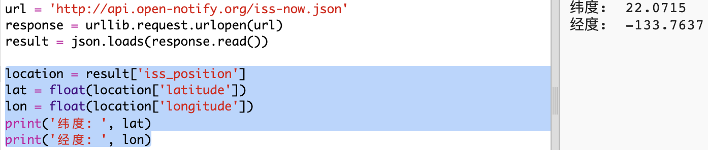

## 国际空间站在哪儿？

国际空间站处于环绕地球的轨道。 它大约每一个半小时完成一次地球轨道，并以每秒7.66公里的平均速度行进。 它很快！

让我们使用另一个网络服务来找出国际空间站的位置。

+ 首先在你的浏览器新标签页中打开网页URL： <a href="http://api.open-notify.org/iss-now.json" target="_blank">http://api.open-notify.org/iss-now.json</a>

你应该看到类似下面的内容：

    {
    “iss_position”：{
      “ latitude”：8.54938193505081， 
      “ longitude”：73.16560793639105
    }， 
    “ message”： “成功”， 
    “ timestamp”：1461931913
    }
    

结果包含国际空间站当前在地球上的点的坐标。

[[[generic-theory-lat-long]]]

+ 现在你需要从 Python 调用相同的 web 服务。 在脚本结尾添加以下代码以获取当前国际空间站位置：

+ 让我们创建变量以存储纬度和经度，然后打印它们：

