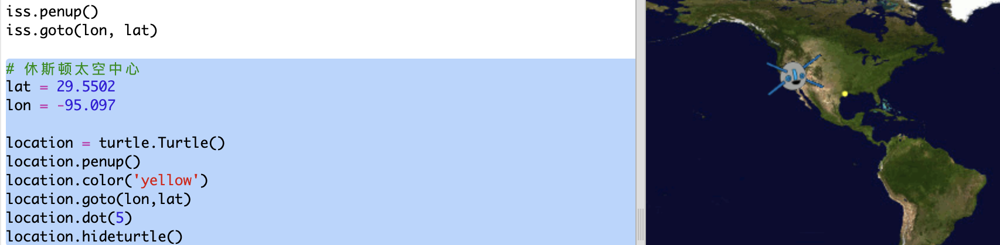

## ISS 何时会到达上空？

你还可以调用另一个 web 服务来找出 ISS 下次会在何时运行到一个特定位置的上空。 

让我们找出 ISS 下次什么时候处于美国休斯顿航天中心的上空，其纬度为 29.5502，经度为 95.097。
  
 

+ 首先让我们在地图上的这些坐标处绘制一个点：

    

+ 现在让我们获取 ISS 下次到达上空的日期和时间。 

    与之前一样，我们可以通过在 web 浏览器的地址栏里输入 url 来调用 web 服务：<a href="http://api.open-notify.org/iss-pass.json" target="_blank">http://api.open-notify.org/iss-pass.json</a>
  
    你会看到一个错误：

    

+ 这项 web 服务将纬度和经度作为输入项，因此我们必须将它们加入我们使用的 url 中。

    输入项添加在 `?` 后面并使用 `&` 隔开。 

    如下所示，向 url 添加 `lat` 和 `lon` 输入项：<a href="http://api.open-notify.org/iss-pass.json?lat=29.55&lon=95.1" target="_blank">http://api.open-notify.org/iss-pass.json?lat=29.55&lon=95.1</a>
  
    
  
    响应结果包括多个经过时间，我们只需查看第一个时间。该时间以标准时间格式给出，你需要在 Python 中将其转化为可读的时间。

+ 现在让我们来从 Python 调用 web 服务：向你的脚本末尾添加以下代码：

    

+ 现在让我们从结果中获得第一次经过的时间。

    添加以下代码：

    

+ 该时间以时间戳的形式给出，因此我们需要 Python 时间模块，使我们能将其打印为可读的格式并将其转化为当地时间。让我们使用海龟写出经过该点的时间。 

+ 在你的脚本顶部添加一行 `import time`：

    

+ `time.ctime()` 函数将该时间转化为你能使用海龟写出的可读格式： 

    
 
    （你可以移除或者注释掉 `print` 行。）

