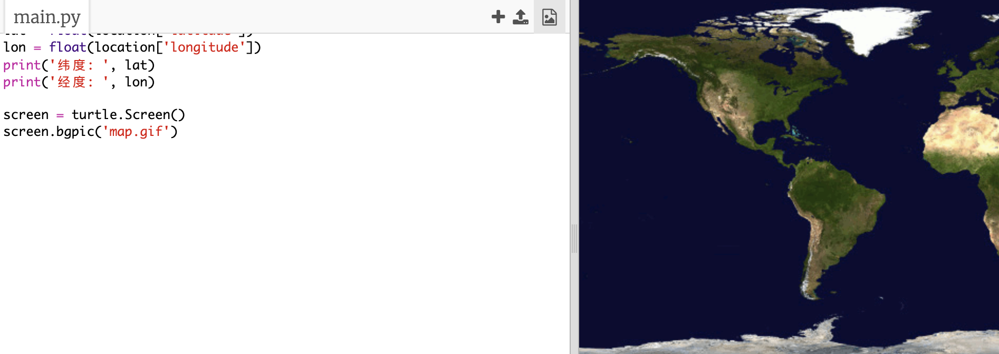
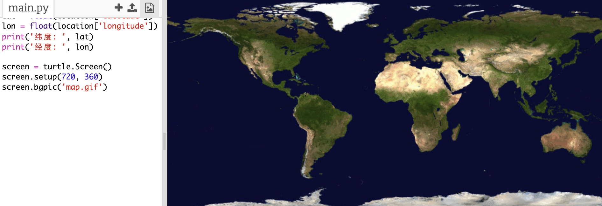
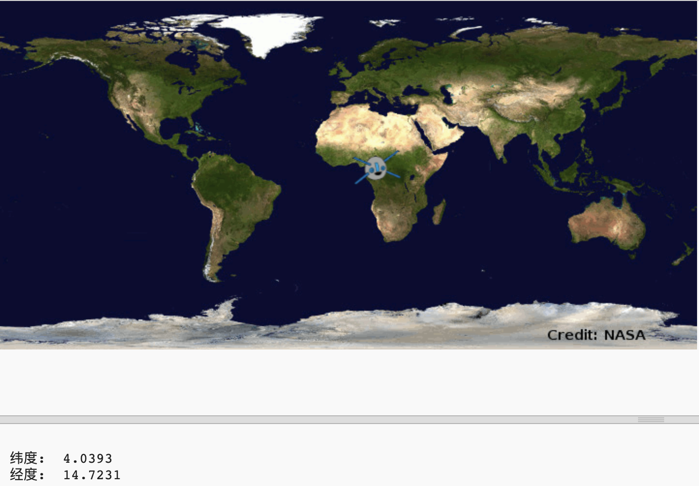

## 在地图上绘制国际空间站的位置

在地图上显示位置会很有用。 你可以使用Python Turtle 图形库来做到这一点！

+ 首先，我们需要导入` turtle ` Python库：

+ 接下来，加载世界地图作为背景图像。 在你的工具中已经包含了一个叫做'map.gif'的图片！ NASA提供了这张精美的地图，并允许其被重复使用。 

地图以`(0,0)` 纬度, 经度为中心，这正是你所需要的。

+ 你需要设置屏幕尺寸以匹配图像尺寸，即720 x 360像素。 添加 `screen.setup(720, 360)`：

+ 你希望能够将特定的纬度和经度发送给turtle库。 为了简化操作，您可以将屏幕设置为与您使用的坐标相匹配：

现在坐标将匹配你从网络服务中返回的纬度和经度坐标。

+ 让我们为国际空间站创建一个turtle图标。 你的小工具包括“iss.gif”和“iss2.gif”，把两个都试试，看看你喜欢哪一个. 

[[[generic-python-turtle-image]]]

\--- 提示 \--- \--- 提示 \---

你的代码应该是这样的：

\--- /hint \---

\--- /hints \---

+ 国际空间站开始在地图中心，现在让我们将其移至正确的位置：

**注意**：纬度通常先给出，但在绘制`(x,y)`坐标时，我们需要先给经度。

+ 通过运行它来测试你的程序。 国际空间站应移至目前它所在地球上方的位置。 

+ 等待几秒钟，再次运行你的程序来查看国际空间站移动到哪里。