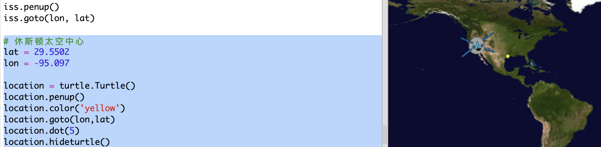
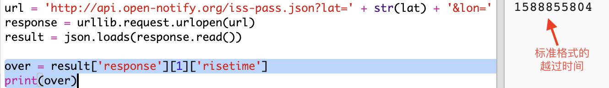
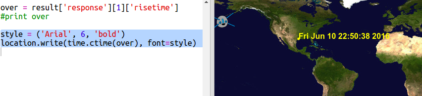

## 国际空间站什么时候会从我们头顶飞过呢？

你也可以使用的网络服务来了解国际空间站何时将位于某个特定位置。

让我们找出国际空间站何时下一次在美国休斯顿的太空中心上空，该中心座标是纬度`29.5502`和经度`95.097`。

+ 首先，让我们在地图上的以下坐标处绘制一个点：

现在让我们找到国际空间站下一次飞过的日期和时间。

+ 和以前一样，你可以通过在Web浏览器的地址栏中输入URL来调用Web服务：<a href="http://api.open-notify.org/iss-pass.json" target="_blank"> api.open-notify.org/iss-pass.json </a>

你应该看到一个错误：

这个网络服务需要纬度和经度作为输入，所以你必须将它们纳入URL。 在 `?`后面添加输入并用`&`分隔。

+ 把`lat`和`lon`添加到网址中，如下所示：<a href="http://api.open-notify.org/iss-pass.json?lat=29.55&lon=95.1" target="_blank"> api.open-notify.org/iss-pass.json?lat=29.55&lon = 95.1 </a>

响应中包含多个飞过的时间，我们只看第一个。 时间以Unix时间格式给出(你可以在Python脚本中将其转换为可读时间)。

[[[generic-unix-timestamp]]]

+ 现在让我们从 Python 中调用这个web 服务。 将以下代码添加到脚本的末尾：

+ 现在让我们从结果中获取第一个飞过的时间。 添加以下代码：

我们需要使用Python `time`库，以便以可读的形式打印并将其转换为本地时间。 然后，我们使用脚本输出飞过休斯顿座标点的时间。

+ 将`import time`语句添加到你的程序的顶部:

+ `time.ctime()`函数会将时间戳转换为可读形式，你可以将其写入地图：

(您可以删除`print`那行, 或者在行首添加`#`, 将其变成评论，所以你的脚本会忽略它。)

+ 如果你喜欢，你可以更改文本的颜色和格式。 

[[[generic-python-turtle-write]]]